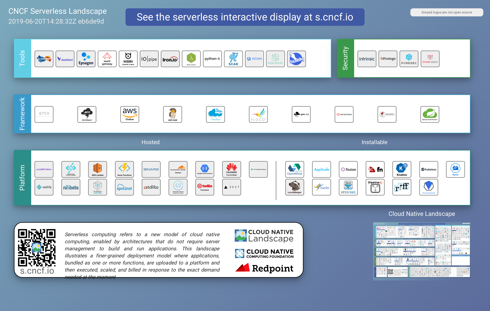

# Cloud-native Overview

## Table of Contents

* [Introduction](#introduction)
* [What is cloud-native ?](#what-is-cloud-native-?)
* [Why cloud-native ?](#why-cloud-native-?)
* [How is it important ?](#how-is-it-important-?)
* [Cloud-native concepts](#cloud-native-concepts)
* [Cloud-native Roadmap](#cloud-native-roadmap)
* [Cloud-native Landscape](#cloud-native-landscape)
* [Cloud-native Serverless Landscape](#cloud-native-serverless-landscape)

## Introduction

Cloud is everywhere. Today, many companies want to migrate their applications on to cloud. For this migration to be done, the applications must be re-architected in a way that they fully utilize the advantages of the cloud.

## What is cloud-native ?

Cloud-native is more about how we build and run applications taking full advantage of cloud computing rather than worrying about where we deploy it.

-	It is not just about optimizing your applications for cloud.
-	Allows you to build scalable systems.
-	Flexible and allows the companies to deliver continuous improvements.

Also cloud-native is an entirely different way of thinking and reasoning about software architecture.

## Why cloud-native ?

Cloud-native applications are different from the traditional applications that run in your data centres. The applications that are designed in the traditional way are not built keeping cloud compatibility in mind. They may have strong ties with the internal systems. Also, they cannot take advantage of all the benefits of the cloud.

So, we need a new architecture for our applications to utilize the benefits of cloud. There is a need to design the applications keeping cloud in mind and take advantage of several cloud services like storing, queuing, caching etc.

## How is it important ?

Speed, safety, and scalability comes with cloud-native applications. It helps you to quickly deliver the advancements. It allows you to have loose ties into the corporate IT where it most certainly would destabilize legacy architectures. It also helps you to continuously deliver your applications with zero downtime. The infrastructure is less predictable, service instances are all disposable, and the deployments are immutable. Also, to meet the expectations of the today’s world customers, these systems are architected for elastic scalability.

## Cloud-native concepts

### Disposable Infrastructure

TBD

### Isolation

TBD

### Scalability

TBD

### Disposable architecture

TBD

### Value added cloud services

TBD

### Polyglot cloud

TBD

### Self-sufficient, full-stack teams

TBD

### Cultural Change

TBD

## Cloud-native Roadmap

## Cloud-native Landscape

## Cloud-native Serverless Landscape

