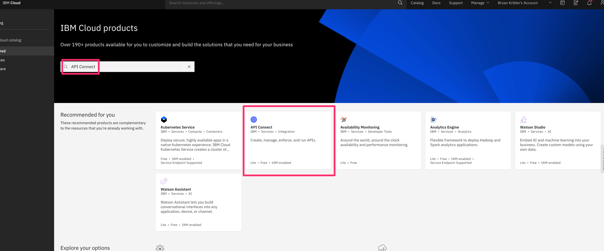
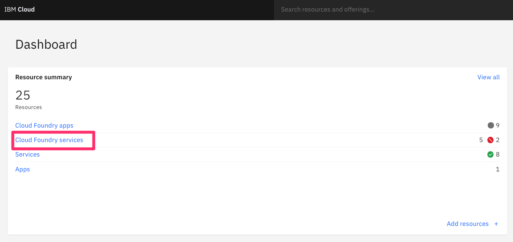

## Login to IBM Cloud

- Go to [IBM Cloud](cloud.ibm.com)

## Create an API Connect Instance

- Once logged into IBM Cloud, you will see your cloud dashboard and look for `Create Resource` in the upper left corner.

- Click `Create Resource` and search for `API Connect` in the search bar.

- Click on the `API Connect` box that appears.

- Next, verify the `region` best for your location and use the `Lite` version.

- At the bottom of the page, you can change the service name. Once that is done click `Create` on the right side of the screen.

- Now your API Connect instance will be created.

## Login to API Connect

Now that we have created the instance, we can now login to it.

- Go to the Cloud Dashboard and click on `Cloud Foundry services`.

- From there, select your `API Connect Instance`.

- Now you are on your API Connect Dashboard where you will find your `Catalogs`.