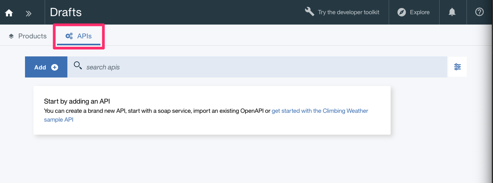
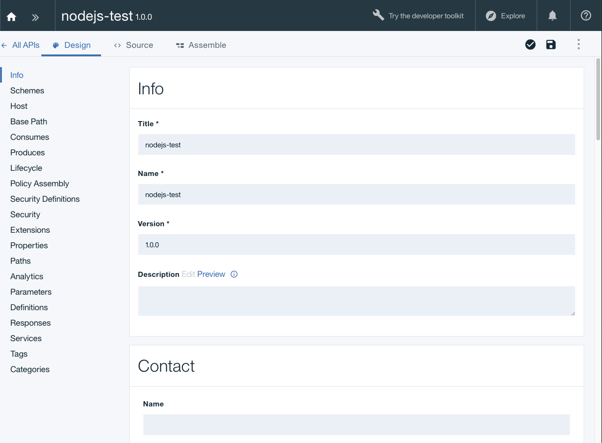
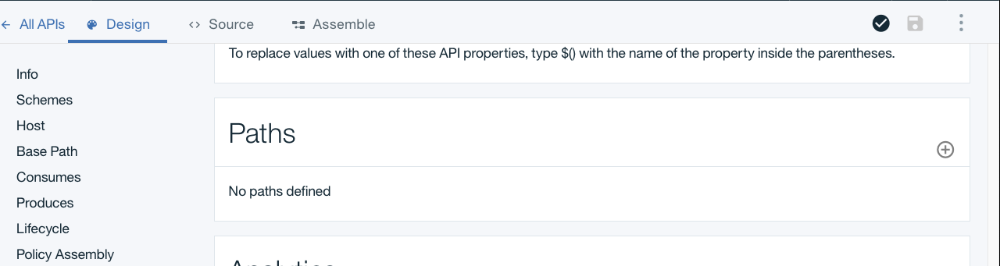
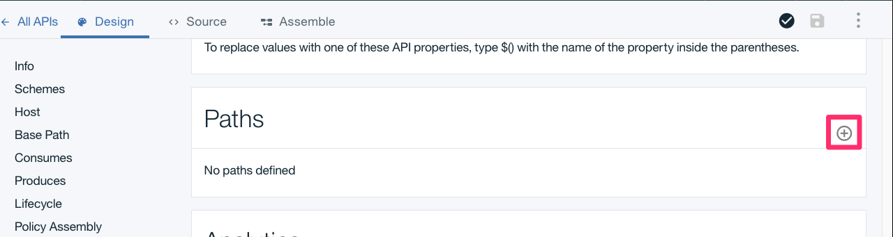
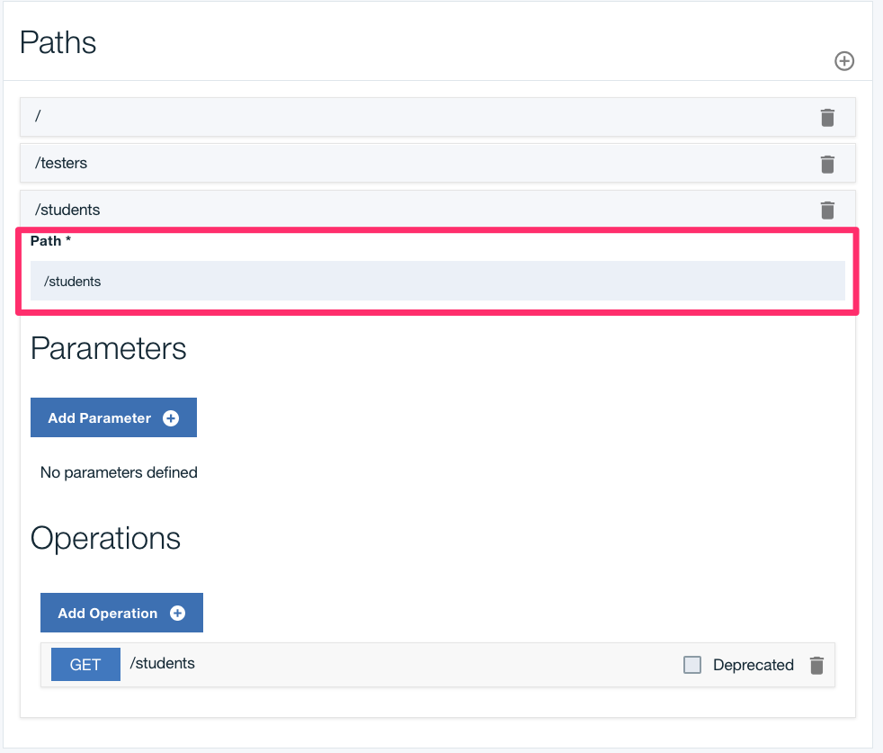
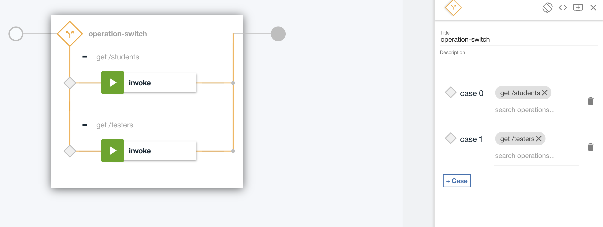
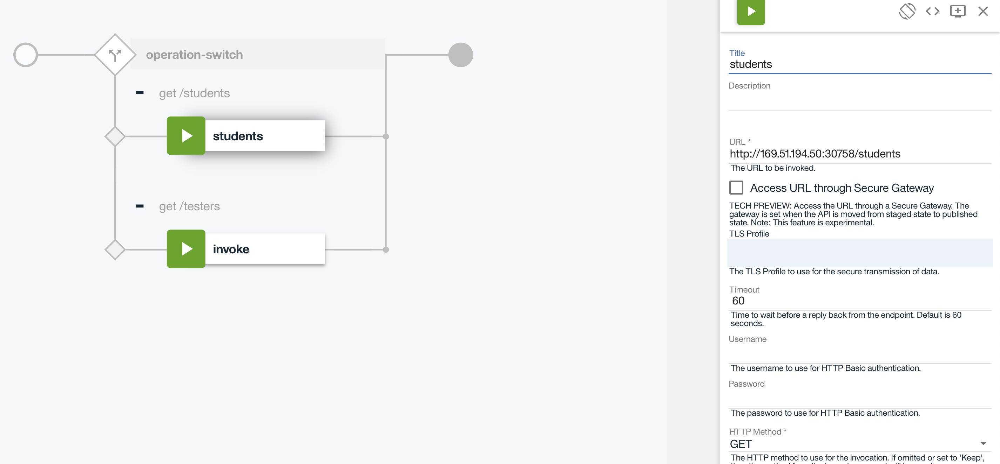
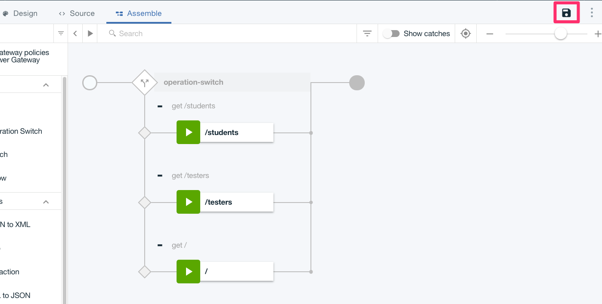
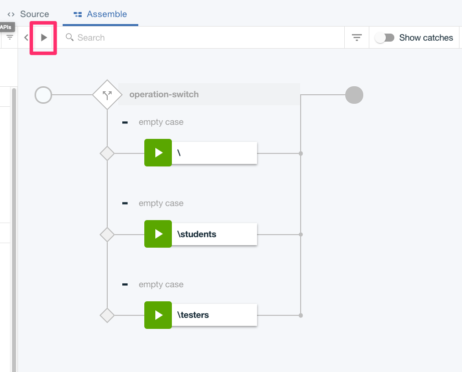

To setup API Connect follow the instructions for [API Connect Access](./accessAPI).

## Create a New Catalog 

- Once logged in, we will be on the API Connect Dashboard.

- Click the `Add` button in the upper left corner and select `Catalog`.

- Name your catalog whatever you like, in this case we are using `Dev`.

- We will be using this catalog for all of our tutorials.

## Create a New Product

- Start by clicking on your catalog name from the main dashboard.

- Click on the top left arrows button next to the catalog name.

- Next, Select `Drafts`.

- On the `Drafts` page, click on the `Add` button in the top left side. Then click `New Product`.

- Fill in the `Product` info with the following:
    - Title: `Development`
    - Name: `Test`
    - Version: `1.0.0`

- Now a new Product named `Test` has been created. On the `Design` page all the details about the product can be changed.

## Create a New API

- With a product created, now we can create a new API for that product.

- Navigate back to the `Drafts` page.

- Click on the top left arrows button next to the catalog name.

- Next, Select `Drafts`.

- Once on the `Drafts` page, Click on the `API's` tab in the top left.

- Click `Add` -> `New API` 

- Fill in the `API` info with the following:
    - Title: `nodejs-test`
    - Name: `nodejs-test`
    - Base Path: `/v1`
    - Version : `1.0.0`
    Additional Properties
    - API Template: `Default`
    - Security: `None`
    - Enabled CORS: `Checked`
    - Gateway: `Micro and DataPower Gateways`

- Click `Create API` and you will be on the API `Design` screen.

- On the Left side of the design page, you will see all the attributes for your new API.

- Next, Click on `Paths` on the left side. There will not be any paths defined yet.

- There are 2 paths that we need to define for our application. Add each using the + on the right side of the `paths` section.

- The paths we need to define are the following:
    - `/`
    - `/students`
    - `/testers`

- With each new `path` you will get a box with 3 options. `Path`, `Parameters`, and `Operations`.

- For this tutorial we only need to modify the `Path` section.

! Note - Each new path automatically creates a `GET` method, that can be modified if needed based on the endpoint.

- Now that we have the `Paths` created we can move to the `Assemble` page.

- On the `Assemble` page, everything is drag and drop. Let's start by dragging and dropping an `Operation-Switch` in front of the `invoke` node.

- This will put the `invoke` statement in the `operation-switch`.

- We need to create an `invoke` statement for each `Path` we created before.

- Once the `invokes` are created, Click on the operation-switch to see the `cases` for each of the invoke statements.

- Make 3 cases for each of the endpoints as seen below.

- Now, Click on the first `invoke` statement and the details for the `invoke` will appear on the right side.

- Let's name each `invoke` after the name of the `path` and we need to modify the `URL` for each as well.

- For each `URL` use `http://169.51.194.50:30758/` plus the `Path`. So for `/students` it would be:
    - Title: `/students`
    - Description: `Students endpoint`
    - URL: `http://169.51.194.50:30758/students`

- Repeat that process for `/` and `/testers`. Once finished, Save your changes by hitting the floppy disk icon in the top left corner.

- This will save all your changes. Now we can test it.

## Testing the API

- To test the API, Click on the `Test` button next to the search bar. (Looks like a play button)

- This will pop up the `Setup` screen on the left side.

- You will see the `Catalog` which is `Dev`. Then the `Product` section. Click the drop-down for `Product` and select your `Product`.

- The API is not currently in the product, so we need to add it by clicking the `Add API` button.

- The API is now added to the `Product` and we need to Republish the Product by clicking `Republish product`.

- Now we can choose an `Operation` to invoke. For the first one we will pick `/students`.

- With the operation chosen we can add any parameters the API would need, but in this case we don't need any so we can just press `Invoke`.

- If everything is successful we will see response with a status of `200` and a JSON object like the one below. 

- That's it. We have successfully built an API. Try out the other operations as well.