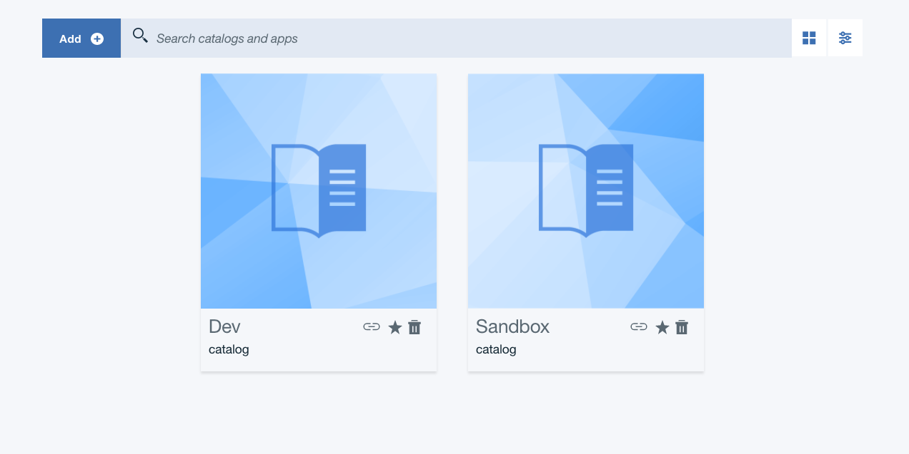
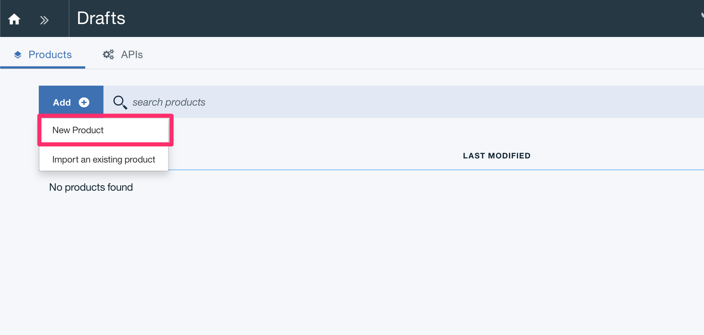
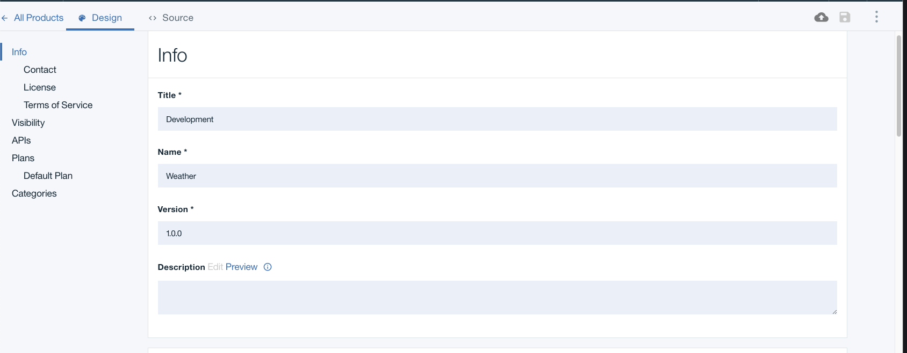

To setup API Connect follow the instructions for [API Connect Access](./accessAPI).

## Create a New Catalog 

- Once logged in, we will be on the API Connect Dashboard.

- Click the `Add` button in the upper left corner and select `Catalog`.

- Name your catalog whatever you like, in this case we are using `Dev`.

- We will be using this catalog for all of our tutorials.

## Create a New Product

- Start by clicking on your catalog name from the main dashboard.

- Click on the top left arrows button next to the catalog name.

- Next, Select `Drafts`.

- On the `Drafts` page, click on the `Add` button in the top left side. Then click `New Product`.

- Fill in the `Product` info with the following:
    - Title: `Weather`
    - Name: `Development`
    - Version: `1.0.0`

- Now a new Product named `Weather` has been created. On the `Design` page all the details about the product can be changed.

## Create a New API

- With a product created, now we can create a new API for that product.

- Navigate back to the `Drafts` page.

- Click on the top left arrows button next to the catalog name.

- Next, Select `Drafts`.

- Once on the `Drafts` page, Click on the `API's` tab in the top left.

- Click `Add` -> `New API` 