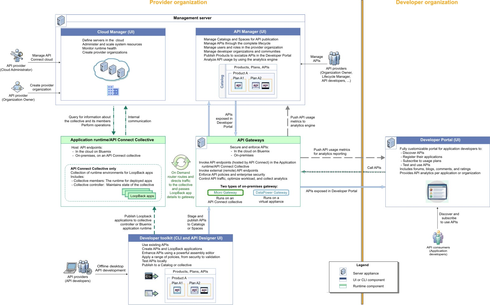

## API Connect

API Connect is a way to quickly create API's and microservices using Node.js and Java runtimes. API Connect allows you to easily create, run, manage and secure API's in one offering.  

<iframe width="560" height="315" src="https://www.youtube.com/embed/qE6Waf0zaP4" frameborder="0" allow="accelerometer; autoplay; encrypted-media; gyroscope; picture-in-picture" allowfullscreen></iframe>

## Architecture

</img>

## Components

**Cloud Manager**

The Cloud Manager is used for on-premise API Connect instances.  The Cloud Administrator will use the Cloud Manager UI for the following:

* Define the Cluster of Management Servers, Gateways, and Containers.
* Manage the topology of the servers and containers.
* Manage the servers in the cloud.
* Monitor Cloud Health.
* Manager User Access Controls.
* Adding user registries for authenticating users and securing APIs, and configure the secure transmission of data.

**The Developer Toolkit**

The developer toolkit provides the tools for modeling, developing, and testing APIs and LoopBack® applications. The developer toolkit includes a command line interface (CLI). It also incorporates LoopBack, an open source Node.js framework.

API developers use the API management functions in the API Manager or the CLI to create draft API definitions for REST and SOAP APIs, or for OAuth provider endpoints that are used for OAuth 2.0 authentication. The API definitions can be configured to add the API to a Product, add a policy assembly flow (to manipulate requests/responses), and to define security options and other settings. APIs can then be tested locally prior to publishing, to ensure they are defined and implemented correctly.

**API Manager**

The API Manager provides a user interface that facilitates promotion and tracking of APIs that are packaged within Products and Plans. API providers can move the Products through their lifecycle, and manage the availability and visibility of APIs and Plans.

Catalogs and Spaces are created in the API Manager to act as staging targets through which APIs, Plans, and Products are published to consumer organizations. API providers can stage their Products to Catalogs or Spaces, and then publish them to make the APIs in those Products visible on a Developer Portal for external discovery.

To control access to the available API management functions, users in the provider organization can be set up in the API Manager UI with assigned roles and permissions. API providers can also use the UI to manage the consumer organizations that sign up to access their APIs and Plans. Developer communities can additionally be created as a way of grouping together a collection of consumer organizations to whom a particular set of Products and Plans can be made available.

The API Manager UI also includes functions to manage the security of the API environment, and provides access to analytics information about API invocation metrics within customizable dashboard views.

**API Gateways**

Gateways enforce runtime policies to secure and control API traffic, provide the endpoints that expose APIs to the calling applications, and provide assembly functions that enable APIs to integrate with various endpoints. They also log and report all API interactions to the API Connect analytics engine, for real-time and historical analytics and reporting

**Developer Portal**

The Developer Portal provides a customizable self-service web-based portal to application developers to explore, discover, and subscribe to APIs.

When API providers publish APIs in the API Manager, those APIs are exposed in the Developer Portal for discovery and usage by application developers in consumer organizations. Application developers can access the Developer Portal UI to register their applications, discover APIs, use the required APIs in their applications (with access approval where necessary), and subsequently deploy those applications.

## API Use Cases

Read about the use cases for APIs which cover Mobile, Social, Data, IoT, and more: [Use Case Scenarios](https://developer.ibm.com/apiconnect/2017/07/20/api-economy-4-business-drivers-7-use-case-categories-series-overview/)

## Presentations

- Presentation: [API Connect Overview 101 PDF](/slides/11-101-API-Connect.pdf)
- Presentation: [API Connect Product Details PDF](/slides/11-201-API-Connect.pdf)
- Presentation: [API Connect Deep Dive PDF](/slides/11-301-API-Connect.pdf)
- Presentation: [API Connect and Istio](/slides/11-401-API-Connect-Istio.pdf)

## Documentation

| Topics                            | Description         | Link        |
| --------------------------------| ------------------  |:----------- |
| API Management | Articles on developer.ibm.com on API Management | See [Article](https://developer.ibm.com/articles/category/api/page/2/?fa=date%3ADESC&fb) |
| Installation | Installing API Connect | See [Docs](https://www.ibm.com/support/knowledgecenter/SSMNED_5.0.0/com.ibm.apic.install.doc/overview_installing_apimgmt.html) |
| Working with the API Connect Toolkit | Covers the differences between traditional messaging architectures and event-driven architectures. | See [Docs](https://www.ibm.com/support/knowledgecenter/SSMNED_5.0.0/com.ibm.apic.toolkit.doc/capim_cli_working_with.html) |
| Working with Catalogs | Details about working with Catalogs in API Connect. | See [Docs](https://www.ibm.com/support/knowledgecenter/SSMNED_5.0.0/com.ibm.apic.apionprem.doc/conref_working_with_env.html) |
| Creating APIs | Covers a deep-dive of Apache Kafka and IBM Event Streams, IBM's Enterprise-grade event-streaming platform. | See [Docs](https://www.ibm.com/support/knowledgecenter/SSMNED_5.0.0/com.ibm.apic.apionprem.doc/task_apionprem_creating_apis_apimgr.html) |
| Managing APIs | Covers managing API's in API Connect. | See [Docs](https://www.ibm.com/support/knowledgecenter/SSMNED_5.0.0/com.ibm.apic.apionprem.doc/APIonPrem_gettingstarted.html) |
| API Analytics| Covers getting the analytics for your API's. | See [Docs](https://www.ibm.com/support/knowledgecenter/SSMNED_5.0.0/com.ibm.apic.apionprem.doc/capim_analytics_apianalytics.html) |
| API Testing and Monitoring| Setting up testing and monitoring for API's | See [Docs](https://ibm-apiconnect.github.io/test-and-monitor/) 

## Activities

| Topics                            | Description         | Link        |
| --------------------------------| ------------------  |:----------- |
| Accessing API Connect | Creating and accessing an API Connect Instance. | [Access API Connect](./activities/accessAPI) |
| Creating APIs | Creating REST APIs using API Connect. | [Creating APIs](./activities/creatingAPIs) |
| Importing an API | Import an existing OpenAPI 2.0 definition. | [Importing APIs](./activities/importingAPIs) |
