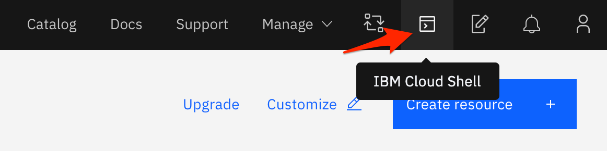
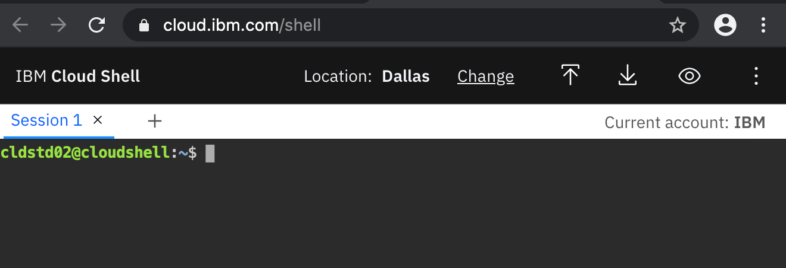
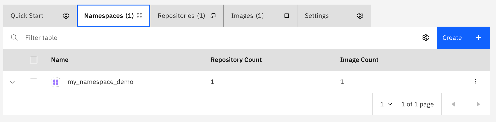
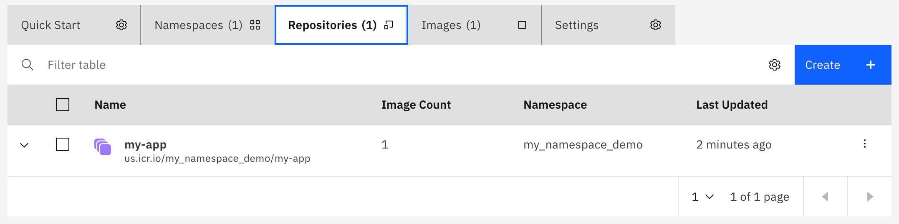
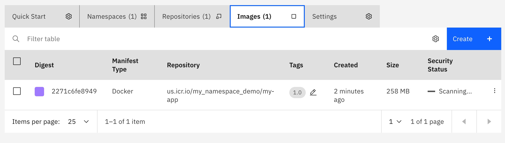

In this lab we are going to create a Container Image and store it in the [IBM Cloud Container Registry](https://cloud.ibm.com/docs/Registry?topic=Registry-registry_overview)

### Prerequisites
- IBM Cloud Account

### Login into IBM Cloud

#### Using the IBM Cloud Shell

1. Login into [IBM Cloud](https://cloud.ibm.com/)
1. Select correct account from top right drop down if your IBM id is associated with multiple accounts
1. Click the IBM Cloud Shell Icon on the top right corner of the IBM Cloud Console
    
1. This opens a new browser window with command linux terminal prompt.
    


### Create a new Container Registry namespace

1. Ensure that you're targeting the correct IBM Cloud Container Registry region. For example for Dallas region use **us-south**
    ```
    ibmcloud cr region-set us-south
    ```
1. Choose a name for your first namespace, and create that namespace. Use this namespace for the rest of the Quick Start.Create a new Container Registry Namespace. This namespace is different from a Kubernetes/OpenShift namespace. The name needs to be all lowercase  and globaly unique within a region.
    ```
    ibmcloud cr namespace-add <my_namespace>
    ```

### Building and Pusing a Container Image
1. Clone the folowwing git repository and change directory to `1-containers`
    ```
    git clone --depth 1 https://github.com/csantanapr/think2020-nodejs.git my-app
    cd my-app/1-containers/
    ```
1. Inspect the file `Dockerfile` it contains a multistage build, first layer builds the application, the second copies only the built files.
    ```
    cat Dockerfile
    ```
    ```Dockerfile
    FROM registry.access.redhat.com/ubi8/nodejs-12 as base

    FROM base as builder

    WORKDIR /opt/app-root/src

    COPY package*.json ./

    RUN npm ci

    COPY public public 
    COPY src src 

    RUN npm run build

    FROM base

    WORKDIR /opt/app-root/src

    COPY --from=builder  /opt/app-root/src/build build

    COPY package*.json ./

    RUN npm ci --only=production

    COPY --chown=1001:0 server server
    RUN chmod -R g=u server

    ENV PORT=8080

    LABEL com.example.source="https://github.com/csantanapr/think2020-nodejs"
    LABEL com.example.version="1.0"

    ARG ENV=production
    ENV NODE_ENV $ENV
    ENV NODE_VERSION $NODEJS_VERSION
    CMD npm run $NODE_ENV
    ```
1. Build and push the image, in the following command replace `<my_namespace>` wit the namespace you added previously, replace `us.icr.io` if using a different region.
    ```
    ibmcloud cr build --tag us.icr.io/<my_namespace>/my-app:1.0 ./
    ```

### Explore the Container Registry on the IBM Cloud Console
1. Explore the container image details using the IBM Cloud Console. Go to the Main Menu->Kubernetes->Registry you can use the tabs `Namespaces`, `Repository`, `Images`
    
    
    
    


### Extra Credit (Run Imge on Kubernetes)

If you have a Kubernetes Cluster you can run your application image

1. Get the Access token for your Kubernetes cluster, command assumes your cluster name is `mycluster`
    ```
    ibmcloud ks cluster config -c mycluster
    ```
1. Run the following commands to create a deployment using the image we just build. Replace `<my_namespace>` with your IBM Container Registry Namespace we stored the image.
    ```
    kubectl create deployment my-app --image us.icr.io/<my_namespace>/my-app:1.0
    kubectl rollout status deployment/my-app
    kubectl port-forward deployment/my-app 8080:8080
    ```
    If the app is connected you should see the following output
    ```
    Forwarding from 127.0.0.1:8080 -> 8080
    Forwarding from [::1]:8080 -> 8080
    ```
1. Open a new Session and run the following command
    ```
    curl localhost:8080 -I
    ```
    You should see in the first line of output the following
    ```
    HTTP/1.1 200 OK
    ```
1. To access the app using a browser use the IBM Cloud Shell Web Preview. Click the Web Preview Icon and select port `8080` from the drop down. The application will open in a new browser window.
    
    

1. To stop the application on the terminal with the `kubectl port-forward` command quit by pressing Ctrl+C in **Session 1*

### Delete Deployment and Image

1. Delete the app deployment
    ```
    kubectl delete deployment my-app
    ```
1. Delete the container image, replace `<my_namespace>`
    ```
    ibmcloud cr image-rm us.icr.io/<my_namespace>/my-app:1.0
    ```
