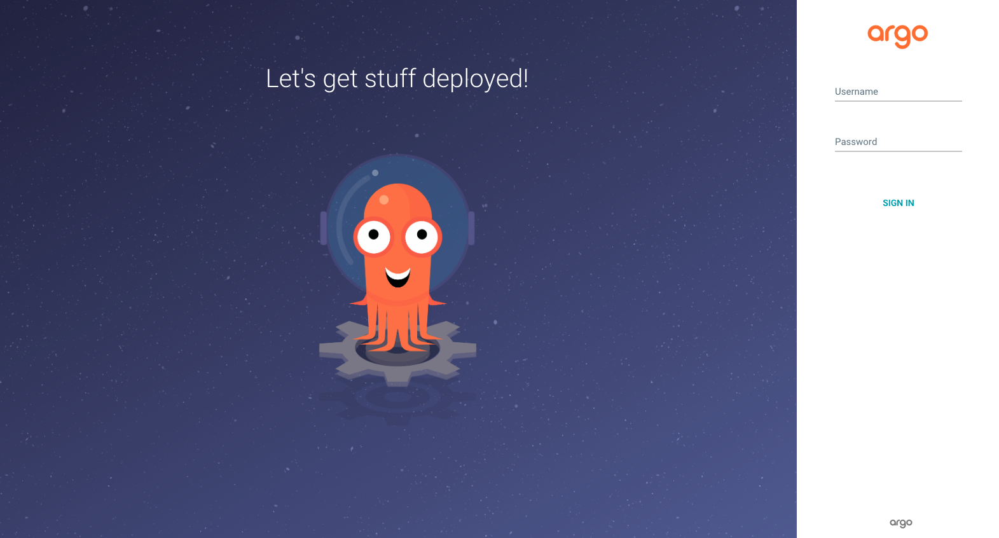
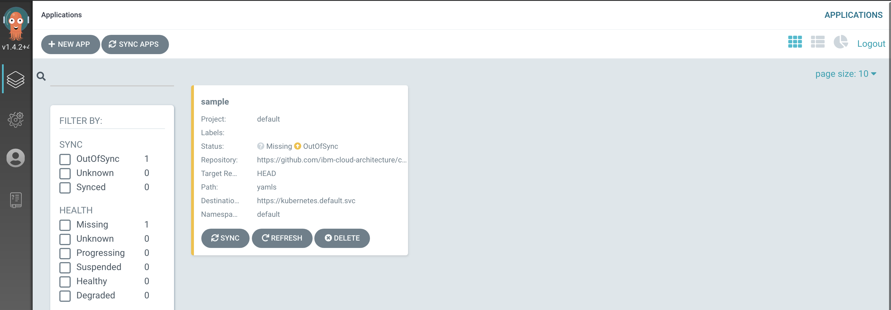
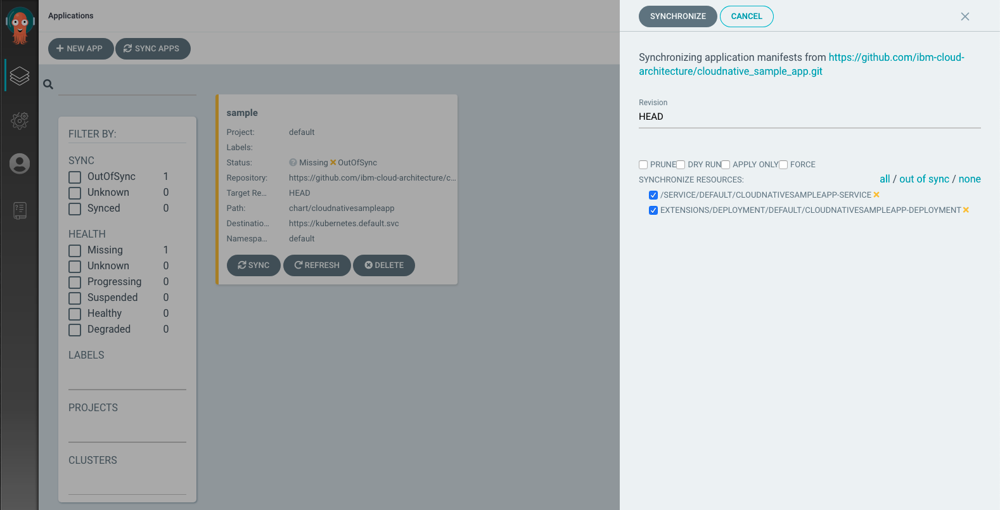
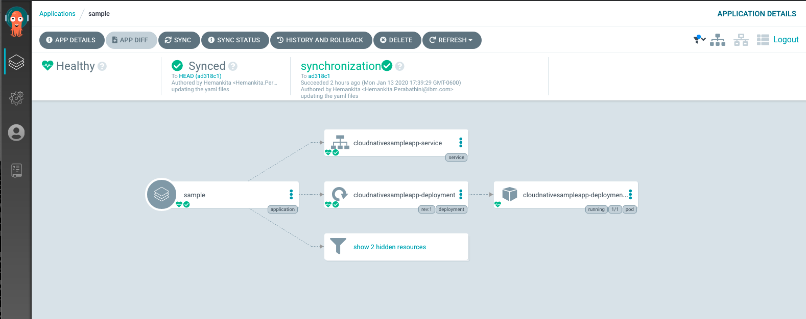
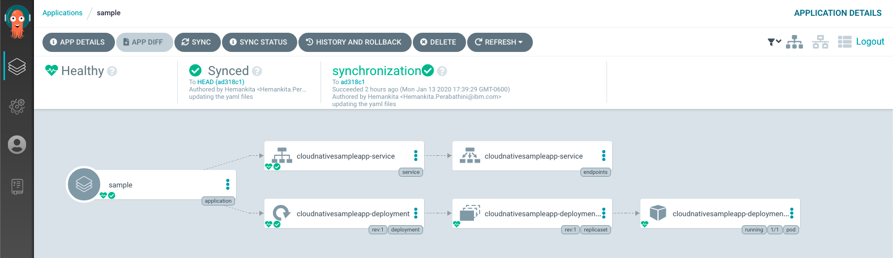

<AnchorLinks>
  <AnchorLink>Pre-requisites</AnchorLink>
  <AnchorLink>Introduction</AnchorLink>
  <AnchorLink>ArgoCD Installation</AnchorLink>
  <AnchorLink>Deploying the Application</AnchorLink>
  <AnchorLink>Verifying the deployment</AnchorLink>
  <AnchorLink>Using the ArgoCD CLI</AnchorLink>
  <AnchorLink>References</AnchorLink>
</AnchorLinks>

<Tabs>
<Tab label="OpenShift">

## Pre-requisites

Make sure your environment is setup properly for the lab.

Check the [Environment Setup](../prerequisites/#environment-setup) page for your setup.

## ArgoCD Installation

- Create the namespace `argocd` to install argocd
    ```bash
    oc new-project argocd
    ```
- Install ArgoCD as follows.
    ```
    oc apply --filename https://raw.githubusercontent.com/ibm-cloud-architecture/learning-cloudnative-101/master/static/yamls/argo-lab/argocd-operator.yaml
    ```
- When installing the tutorial, make sure you wait until the argocd-operator is finished before installing the argocd-cr..or it will fail. You can do this:
    ```bash
    oc get ClusterServiceVersion -n argocd
    NAME                                   DISPLAY                        VERSION   REPLACES   PHASE
    argocd-operator.v0.0.8                 Argo CD                        0.0.8                Succeeded
    ```
    and wait for the "succeeded" to come up before proceeding.
    ```
    oc apply --filename https://raw.githubusercontent.com/ibm-cloud-architecture/learning-cloudnative-101/master/static/yamls/argo-lab/argocd-cr.yaml
    ```
    and wait for the argocd server Pod to be running
    ```
    oc get pods -n argocd -l app.kubernetes.io/name=example-argocd-server
    ```
    ```
    NAME                                     READY   STATUS    RESTARTS   AGE
    example-argocd-server-57c4fd5c45-zf4q6   1/1     Running   0          115s
    ```
- Install the `argocd` CLI, for example on OSX use brew
    ```bash
    brew tap argoproj/tap
    brew install argoproj/tap/argocd
    ```
- Set an environment variable `ARGOCD_URL` using the `EXTERNAL-IP`
    ```bash
    export ARGOCD_NAMESPACE="argocd"
    export ARGOCD_SERVER=$(oc get route example-argocd-server -n $ARGOCD_NAMESPACE -o jsonpath='{.spec.host}')
    export ARGOCD_URL="https://$ARGOCD_SERVER"
    echo ARGOCD_URL=$ARGOCD_URL
    echo ARGOCD_SERVER=$ARGOCD_SERVER
    ```

## Deploying the app

- Login into the UI.
    ```bash
    open $ARGOCD_URL
    ```
- Use `admin` as the username and get the password with the following command
    ```bash
    oc get secret example-argocd-cluster -n $ARGOCD_NAMESPACE -o jsonpath='{.data.admin\.password}' | base64 -d
    ```
    For example the output is similar to this:
    ```
    tyafMb7BNvO0kP9eizx3CojrK8pYJFQq
    ```



- Now go back to the ArgoCD home and click on `NEW APP`.
- Add the below details:
- Application Name: `sample`
- Project - `default`
- SYNC POLICY: `Manual`
- REPO URL: `https://github.com/ibm-cloud-architecture/cloudnative_sample_app_deploy`
- Revision: `HEAD`
- Path: `openshift`


- Cluster - Select the default one `https://kubernetes.default.svc` to deploy in-cluster
- Namespace - `default`
- Click Create to finish


- You will now see the available apps.



- Initially, the app will be out of sync. It is yet to be deployed. You need to sync it for deploying.

To sync the application, click `SYNC` and then `SYNCHRONIZE`.



- Wait till the app is deployed.


- Once the app is deployed, click on it to see the details.





## Verifying the deployment

- Access the app to verify if it is correctly deployed.
- List the cloudnativesampleapp-service route
    ```
    oc get route
    ```
    It should have an IP under `EXTERNAL-IP` column
    ```
    NAME                 HOST/PORT                                     PATH   SERVICES                       PORT   TERMINATION   WILDCARD
    cloudnative-sample   cloudnative-sample-default.apps-crc.testing          cloudnativesampleapp-service   9080                 None
    ```
- Set an environment variable `APP_URL` using the `EXTERNAL-IP`
    ```
    export APP_URL="http://$(oc get route cloudnative-sample -o jsonpath='{.status.ingress[0].host}')"
    echo ARGOCD_SERVER=$APP_URL
    ```
- Access the url using `curl`
    ```
    curl "$APP_URL/greeting?name=Carlos"
    ```
    ```
    {"id":2,"content":"Welcome to Cloudnative bootcamp !!! Hello, Carlos :)"}
    ```

## Using the ArgoCD CLI

- Login using the cli.
- Use `admin` as the username and get the password with the following command
    ```bash
    export ARGOCD_PASSWORD=$(oc get secret example-argocd-cluster -n $ARGOCD_NAMESPACE -o jsonpath='{.data.admin\.password}' | base64 -d)
    echo $ARGOCD_PASSWORD
    ```
- Now login as follows.
    ```bash
    argocd login --username admin --password $ARGOCD_PASSWORD $ARGOCD_SERVER
    ```
    ```
    WARNING: server certificate had error: x509: cannot validate certificate for 10.97.240.99 because it doesn't contain 
    any IP SANs. Proceed insecurely (y/n)? y

    'admin' logged in successfully
    Context 'example-argocd-server-argocd.apps-crc.testing' updated
    ```
- List the applications
    ```bash
    argocd app list
    ```
    ```
    NAME    CLUSTER                         NAMESPACE  PROJECT  STATUS  HEALTH   SYNCPOLICY  CONDITIONS  REPO                                                                     PATH   TARGET
    sample  https://kubernetes.default.svc  default    default  Synced  Healthy  <none>      <none>      https://github.com/ibm-cloud-architecture/cloudnative_sample_app_deploy  openshift  HEAD
    ```
- Get application details
    ```bash
    argocd app get sample
    ```
    ```
    Name:               sample
    Project:            default
    Server:             https://kubernetes.default.svc
    Namespace:          default
    URL:                https://10.97.240.99/applications/sample
    Repo:               https://github.com/ibm-cloud-architecture/cloudnative_sample_app_deploy
    Target:             HEAD
    Path:               openshift
    SyncWindow:         Sync Allowed
    Sync Policy:        <none>
    Sync Status:        Synced to HEAD (9684037)
    Health Status:      Healthy

    GROUP  KIND        NAMESPACE  NAME                             STATUS  HEALTH   HOOK  MESSAGE
        Service     default    cloudnativesampleapp-service     Synced  Healthy        service/cloudnativesampleapp-service created
    apps   Deployment  default    cloudnativesampleapp-deployment  Synced  Healthy        deployment.apps/cloudnativesampleapp-deployment created
    ```
- Show application deployment history
    ```bash
    argocd app history sample
    ```
    ```
    ID  DATE                           REVISION
    0   2020-02-12 21:10:32 -0500 EST  HEAD (9684037)
    ```
## References

- [ArgoCD](https://argoproj.github.io/argo-cd/)

</Tab>

<Tab label="IKS">

## Pre-requisites

Make sure your environment is setup properly for the lab.

Check the [Environment Setup](../prerequisites/#environment-setup) page for your setup.

## ArgoCD Installation

- Create the namespace `argocd` to install argocd
    ```bash
    kubectl create namespace argocd
    export ARGOCD_NAMESPACE=argocd
    ```
- Create RBAC resources
    ```bash
    kubectl create -n argocd -f https://raw.githubusercontent.com/argoproj-labs/argocd-operator/v0.0.8/deploy/service_account.yaml
    kubectl create -n argocd -f https://raw.githubusercontent.com/argoproj-labs/argocd-operator/v0.0.8/deploy/role.yaml
    kubectl create -n argocd -f https://raw.githubusercontent.com/argoproj-labs/argocd-operator/v0.0.8/deploy/role_binding.yaml
    kubectl create -n argocd -f https://raw.githubusercontent.com/ibm-cloud-architecture/learning-cloudnative-101/master/static/yamls/argo-lab/argo-clusteradmin.yaml
    ```

- Install CRDs
    ```bash
    kubectl create -n argocd -f https://raw.githubusercontent.com/argoproj-labs/argocd-operator/v0.0.8/deploy/argo-cd/argoproj.io_applications_crd.yaml
    kubectl create -n argocd -f https://raw.githubusercontent.com/argoproj-labs/argocd-operator/v0.0.8/deploy/argo-cd/argoproj.io_appprojects_crd.yaml
    kubectl create -n argocd -f https://raw.githubusercontent.com/argoproj-labs/argocd-operator/v0.0.8/deploy/crds/argoproj.io_argocdexports_crd.yaml
    kubectl create -n argocd -f https://raw.githubusercontent.com/argoproj-labs/argocd-operator/v0.0.8/deploy/crds/argoproj.io_argocds_crd.yaml
    ```
    Verify CRDs
    ```bash
    kubectl get crd -n argocd
    ```
    ```
    NAME                        CREATED AT
    applications.argoproj.io    2020-05-15T02:05:55Z
    appprojects.argoproj.io     2020-05-15T02:05:56Z
    argocdexports.argoproj.io   2020-05-15T02:08:21Z
    argocds.argoproj.io         2020-05-15T02:08:21Z
    ```
- Deploy Operator
    ```bash
    kubectl create -n argocd -f https://raw.githubusercontent.com/argoproj-labs/argocd-operator/v0.0.8/deploy/operator.yaml
    ```
- Deploy ArgoCD CO
    ```bash
    kubectl create -n argocd -f https://raw.githubusercontent.com/argoproj-labs/argocd-operator/v0.0.8/examples/argocd-lb.yaml
    ```
    Verify that ArgoCD Pods are running
    ```bash
    kubectl get pods -n argocd
    ```
    ```
    NAME                                                     READY   STATUS    RESTARTS   AGE
    argocd-operator-5f7d8cf7d8-486vn                         1/1     Running   0          3m46s
    example-argocd-application-controller-7dc5fcb75d-xkk5h   1/1     Running   0          2m3s
    example-argocd-dex-server-bb9df96cb-ndmhl                1/1     Running   0          2m3s
    example-argocd-redis-756b6764-sb2gt                      1/1     Running   0          2m3s
    example-argocd-repo-server-75944fcf87-zmh48              1/1     Running   0          2m3s
    example-argocd-server-747b684c8c-xhgl9                   1/1     Running   0          2m3s
    ```
    Verify that the other ArgoCD resources are created
    ```
    kubectl get cm,secret,svc,deploy -n argocd
    ```
- List the argocd-server service
    ```bash
    kubectl get svc example-argocd-server -n argocd
    ```
- From the script, the Argo Server service has a `type` of `LoadBalancer`. If the `ExternalIP` is in a `pending` state, then there is no loadBalancer for your cluster, so we only need the the ArgoCD server's `NodePort`. Otherwise use the `ExternalIP` and `NodePort` to access Argo.
    ```
    NAME                    TYPE           CLUSTER-IP      EXTERNAL-IP     PORT(S)                      AGE
    example-argocd-server   LoadBalancer   10.105.73.245   <pending>   80:31138/TCP,443:31932/TCP   5m3s
    ```
- To access the service we need the `Node's External IP` and the `NodePort`. Let's set an environment variable `ARGOCD_URL` with `NODE_EXTERNAL_IP`:`NodePort`.
    ```bash
    export NODE_EXTERNAL_IP="$(kubectl get nodes -o jsonpath='{.items[0].status.addresses[?(@.type=="ExternalIP")].address}')"
    export ARGOCD_NODEPORT="$(kubectl get svc example-argocd-server -n $ARGOCD_NAMESPACE -o jsonpath='{.spec.ports[0].nodePort}')"
    export ARGOCD_URL="https://$EXTERNAL_IP:$ARGOCD_NODEPORT"
    echo ARGOCD_URL=$ARGOCD_URL
    ```

## Deploying the app

- Login into the UI.
    ```bash
    open $ARGOCD_URL
    ```
- Use `admin` as the username and get the password with the following command
    ```bash
    kubectl get secret example-argocd-cluster -n $ARGOCD_NAMESPACE -o jsonpath='{.data.admin\.password}' | base64 -d
    ```
    For example the output is similar to this:
    ```
    tyafMb7BNvO0kP9eizx3CojrK8pYJFQq
    ```


- Now go back to the ArgoCD home and click on `NEW APP`.
- Add the below details:
- Application Name: `sample`
- Project - `default`
- SYNC POLICY: `Manual`
- REPO URL: `https://github.com/ibm-cloud-architecture/cloudnative_sample_app_deploy`
- Revision: `HEAD`
- Path: `kubernetes`


- Cluster - Select the default one `https://kubernetes.default.svc` to deploy in-cluster
- Namespace - `default`
- Click Create to finish


- You will now see the available apps.


- Initially, the app will be out of sync. It is yet to be deployed. You need to sync it for deploying.

To sync the application, click `SYNC` and then `SYNCHRONIZE`.


- Wait till the app is deployed.


- Once the app is deployed, click on it to see the details.


## Verifying the deployment

- Access the app to verify if it is correctly deployed.
- List the cloudnativesampleapp-service service
    ```bash
    kubectl get svc cloudnativesampleapp-service
    ```
    It will have the `NodePort` for the application. In this case, it is `30499`. 
    ```
    NAME                           TYPE       CLUSTER-IP       EXTERNAL-IP   PORT(S)          AGE
    cloudnativesampleapp-service   NodePort   172.21.118.165   <none>        9080:30499/TCP   20s
    ```
- Set an environment variable `APP_URL` using the `Node's IP` and `NodePort` values
    ```bash
    export APP_NODE_PORT="$(kubectl get svc cloudnativesampleapp-service -n default -o jsonpath='{.spec.ports[0].nodePort}')"
    export APP_URL="$NODE_EXTERNAL_IP:$APP_NODE_PORT"
    echo ARGOCD_SERVER=$APP_URL
    ```
- Access the url using `curl`
    ```bash
    curl "$APP_URL/greeting?name=Carlos"
    ```
    ```
    {"id":2,"content":"Welcome to Cloudnative bootcamp !!! Hello, Carlos :)"}
    ```

## References

- [ArgoCD](https://argoproj.github.io/argo-cd/)

</Tab>

<Tab label="Minikube">

## Pre-requisites

Make sure your environment is setup properly for the lab.

Check the [Environment Setup](../prerequisites/#environment-setup) page for your setup.

- Install the `argocd` CLI, for example on OSX use brew
    ```bash
    brew tap argoproj/tap
    brew install argoproj/tap/argocd
    ```

- Remember to have minikube tunnel running in another terminal
    ```bash
    minikube tunnel
    ```

## ArgoCD Installation

- Create the namespace `argocd` to install argocd
    ```bash
    kubectl create namespace argocd
    ```
- Create RBAC resources
    ```bash
    kubectl create -n argocd -f https://raw.githubusercontent.com/argoproj-labs/argocd-operator/v0.0.8/deploy/service_account.yaml
    kubectl create -n argocd -f https://raw.githubusercontent.com/argoproj-labs/argocd-operator/v0.0.8/deploy/role.yaml
    kubectl create -n argocd -f https://raw.githubusercontent.com/argoproj-labs/argocd-operator/v0.0.8/deploy/role_binding.yaml
    ```
    Create ClusterRoleBinding for `cluster-admin` role for `sa` `argocd-application-controller` in namespace `argocd`
    ```bash
    cat <<'EOF' | kubectl create -f -
    apiVersion: rbac.authorization.k8s.io/v1
    kind: ClusterRoleBinding
    metadata:
      labels:
        app.kubernetes.io/component: application-controller
        app.kubernetes.io/name: argocd-application-controller
        app.kubernetes.io/part-of: argocd
      name: argocd-application-controller
    roleRef:
      apiGroup: rbac.authorization.k8s.io
      kind: ClusterRole
      name: cluster-admin
    subjects:
      - kind: ServiceAccount
        name: argocd-application-controller
        namespace: argocd
    EOF
    ```
- Install CRDs
    ```bash
    kubectl create -n argocd -f https://raw.githubusercontent.com/argoproj-labs/argocd-operator/v0.0.8/deploy/argo-cd/argoproj.io_applications_crd.yaml
    kubectl create -n argocd -f https://raw.githubusercontent.com/argoproj-labs/argocd-operator/v0.0.8/deploy/argo-cd/argoproj.io_appprojects_crd.yaml
    kubectl create -n argocd -f https://raw.githubusercontent.com/argoproj-labs/argocd-operator/v0.0.8/deploy/crds/argoproj.io_argocdexports_crd.yaml
    kubectl create -n argocd -f https://raw.githubusercontent.com/argoproj-labs/argocd-operator/v0.0.8/deploy/crds/argoproj.io_argocds_crd.yaml
    ```
    Verify CRDs
    ```bash
    kubectl get crd -n argocd
    ```
    ```
    NAME                        CREATED AT
    applications.argoproj.io    2020-05-15T02:05:55Z
    appprojects.argoproj.io     2020-05-15T02:05:56Z
    argocdexports.argoproj.io   2020-05-15T02:08:21Z
    argocds.argoproj.io         2020-05-15T02:08:21Z
    ```
- Deploy Operator
    ```bash
    kubectl create -n argocd -f https://raw.githubusercontent.com/argoproj-labs/argocd-operator/v0.0.8/deploy/operator.yaml
    ```
- Deploy ArgoCD CO
    ```bash
    kubectl create -n argocd -f https://raw.githubusercontent.com/argoproj-labs/argocd-operator/v0.0.8/examples/argocd-lb.yaml
    ```
    Verify that ArgoCD Pods are running
    ```bash
    kubectl get pods -n argocd
    ```
    ```
    NAME                                                     READY   STATUS    RESTARTS   AGE
    argocd-operator-5f7d8cf7d8-486vn                         1/1     Running   0          3m46s
    example-argocd-application-controller-7dc5fcb75d-xkk5h   1/1     Running   0          2m3s
    example-argocd-dex-server-bb9df96cb-ndmhl                1/1     Running   0          2m3s
    example-argocd-redis-756b6764-sb2gt                      1/1     Running   0          2m3s
    example-argocd-repo-server-75944fcf87-zmh48              1/1     Running   0          2m3s
    example-argocd-server-747b684c8c-xhgl9                   1/1     Running   0          2m3s
    ```
    Verify that the other ArgoCD resources are created
    ```
    kubectl get cm,secret,svc,deploy -n argocd
    ```
- Expose the ArgoCD Server service as a NodePort.
    ```bash
    kubectl expose deployment.apps/example-argocd-server --type="NodePort" --port 8080 --name=argo-nodeport -n argocd  
    ```
- List the argocd-server service
    ```bash
    kubectl get svc example-argocd-server -n argocd
    ```
    It should have an IP under `EXTERNAL-IP` column
    ```
    NAME                    TYPE           CLUSTER-IP      EXTERNAL-IP   PORT(S)                      AGE
    example-argocd-server   LoadBalancer   172.21.106.88   <pending>     80:32010/TCP,443:31861/TCP   111m
    ```
- Set an environment variable `ARGOCD_URL` using the `EXTERNAL-IP`
    ```bash
    export ARGOCD_NAMESPACE=argocd
    export ARGOCD_SERVER="$(kubectl get svc example-argocd-server -n $ARGOCD_NAMESPACE -o jsonpath='{.status.loadBalancer.ingress[0].ip}')"
    export ARGOCD_URL="https://$ARGOCD_SERVER"
    echo ARGOCD_URL=$ARGOCD_URL
    echo ARGOCD_SERVER=$ARGOCD_SERVER
    ```

## Deploying the app

- Login into the UI.
    ```bash
    open $ARGOCD_URL
    ```
- Use `admin` as the username and get the password with the following command
    ```bash
    kubectl get secret example-argocd-cluster -n $ARGOCD_NAMESPACE -o jsonpath='{.data.admin\.password}' | base64 -d
    ```
    For example the output is similar to this:
    ```
    tyafMb7BNvO0kP9eizx3CojrK8pYJFQq
    ```


- Now go back to the ArgoCD home and click on `NEW APP`.
- Add the below details:
- Application Name: `sample`
- Project - `default`
- SYNC POLICY: `Manual`
- REPO URL: `https://github.com/ibm-cloud-architecture/cloudnative_sample_app_deploy`
- Revision: `HEAD`
- Path: `kubernetes`


- Cluster - Select the default one `https://kubernetes.default.svc` to deploy in-cluster
- Namespace - `default`
- Click Create to finish


- You will now see the available apps.


- Initially, the app will be out of sync. It is yet to be deployed. You need to sync it for deploying.

To sync the application, click `SYNC` and then `SYNCHRONIZE`.


- Wait till the app is deployed.


- Once the app is deployed, click on it to see the details.


## Verifying the deployment

- Access the app to verify if it is correctly deployed.
- List the cloudnativesampleapp-service service
    ```bash
    kubectl get svc cloudnativesampleapp-service
    ```
    It should have an IP under `EXTERNAL-IP` column
    ```
    NAME                           TYPE           CLUSTER-IP       EXTERNAL-IP      PORT(S)          AGE
    cloudnativesampleapp-service   NodePort       10.109.242.212   10.109.242.212   9080:31905/TCP   13m
    ```
- Set an environment variable `APP_URL` using the `EXTERNAL-IP` and `NodePort` values
    ```bash
    export APP_URL="$(minikube service --url cloudnativesampleapp-service -n default)"
    echo ARGOCD_SERVER=$APP_URL
    ```
- Access the url using `curl`
    ```bash
    curl "$APP_URL/greeting?name=Carlos"
    ```
    ```
    {"id":2,"content":"Welcome to Cloudnative bootcamp !!! Hello, Carlos :)"}
    ```

## Using the ArgoCD CLI

- Login using the cli.
- Use `admin` as the username and get the password with the following command
    ```bash
    export ARGOCD_PASSWORD=$(kubectl get secret example-argocd-cluster -n $ARGOCD_NAMESPACE -o jsonpath='{.data.admin\.password}' | base64 -d)
    echo $ARGOCD_PASSWORD
    ```
- Now login as follows.
    ```bash
    argocd login --username admin --password $ARGOCD_PASSWORD $ARGOCD_SERVER
    ```
    ```
    WARNING: server certificate had error: x509: cannot validate certificate for 10.97.240.99 because it doesn't contain 
    any IP SANs. Proceed insecurely (y/n)? y

    'admin' logged in successfully
    Context '10.105.73.245' updated
    ```
- List the applications
    ```bash
    argocd app list
    ```
    ```
    NAME    CLUSTER                         NAMESPACE  PROJECT  STATUS  HEALTH   SYNCPOLICY  CONDITIONS  REPO                                                                     PATH   TARGET
    sample  https://kubernetes.default.svc  default    default  Synced  Healthy  <none>      <none>      https://github.com/ibm-cloud-architecture/cloudnative_sample_app_deploy  kubernetes  HEAD
    ```
- Get application details
    ```bash
    argocd app get sample
    ```
    ```
    Name:               sample
    Project:            default
    Server:             https://kubernetes.default.svc
    Namespace:          default
    URL:                https://10.97.240.99/applications/sample
    Repo:               https://github.com/ibm-cloud-architecture/cloudnative_sample_app_deploy
    Target:             HEAD
    Path:               kubernetes
    SyncWindow:         Sync Allowed
    Sync Policy:        <none>
    Sync Status:        Synced to HEAD (9684037)
    Health Status:      Healthy

    GROUP  KIND        NAMESPACE  NAME                             STATUS  HEALTH   HOOK  MESSAGE
        Service     default    cloudnativesampleapp-service     Synced  Healthy        service/cloudnativesampleapp-service created
    apps   Deployment  default    cloudnativesampleapp-deployment  Synced  Healthy        deployment.apps/cloudnativesampleapp-deployment created
    ```
- Show application deployment history
    ```bash
    argocd app history sample
    ```
    ```
    ID  DATE                           REVISION
    0   2020-02-12 21:10:32 -0500 EST  HEAD (9684037)
    ```
## References

- [ArgoCD](https://argoproj.github.io/argo-cd/)

</Tab>

</Tabs>
