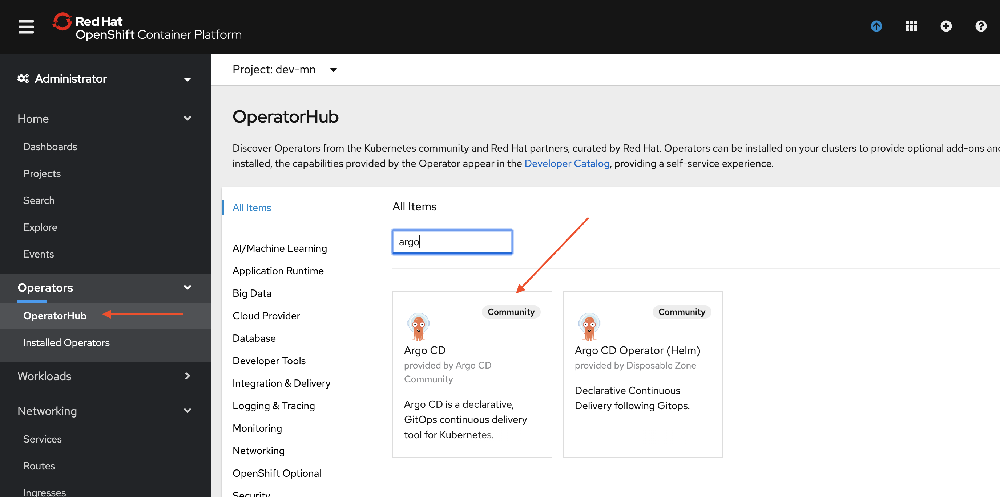
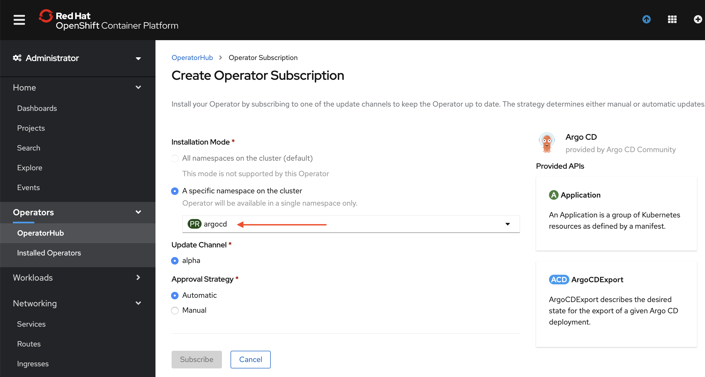

<AnchorLinks>
  <AnchorLink>Pre-requisites</AnchorLink>
  <AnchorLink>Introduction</AnchorLink>
  <AnchorLink>ArgoCD Installation</AnchorLink>
  <AnchorLink>Deploying the Application</AnchorLink>
  <AnchorLink>Verifying the deployment</AnchorLink>
  <AnchorLink>Using the ArgoCD CLI</AnchorLink>
  <AnchorLink>References</AnchorLink>
</AnchorLinks>

## Pre-requisites

The following checks ensure that each chapter exercises are done with the right environment settings.

- Verify Kubernetes CLI version, ti should be v1.15+
    ```bash
    kubectl version
    ```
- Verify your cluster has 4GB+ memory, and kubernetes 1.16+
    ```bash
    minikube config view
    ```
- In case memory is not set, or need to increase set the memory and recreate the VM
    ```bash
    minikube config set memory 4096
    minikube config set kubernetes-version v1.16.6
    ```
- Delete the minikube VM and start a new one
    ```bash
    minikube delete
    minikube start
    ```
- In a new terminal run `minikube tunnel` to allow you to access services from your browser or terminal
    ```bash
    minikube tunnel
    ```


## ArgoCD Installation

- Create the namespace `argocd` to install argocd
    ```bash
    kubectl create namespace argocd
    ```

- With the `argocd` project selected, go to the operator hub and search for `argo`

- Select the Argo CD operator



*Note: use the ArgoCD-provided operator*

- Select `Continue` and `Install`

- On the `Create Operator Subscription` screen, select the installation namespace to be `argocd` (your newly created project)



- To enable full cluster admin access on OpenShift, run the following command. This step is generally optional but recommended for this exercise.

    ```bash
    oc adm policy add-cluster-role-to-user cluster-admin -z argocd-application-controller -n argocd
    ```

- Take the [argo-cd.yaml](/yamls/argocd/argo-cd.yaml file and apply it in the `argocd` namespace

    ```bash
    oc project argocd
    oc apply -f ./argo-cd.yaml
    ```

- There will be several Argo CD resources created:

    ```bash
    oc get cm,secret,deploy
    ```

- When everything is installed, you can fetch argocd's URLs:

    ```bash
    oc get routes
    ``` 

## Deploying the app

- Login into the UI.

- Use `admin` as the username and get the password with the following command (extracting the password from one of the secrets created) in  the previous step
    ```bash
    kubectl get secret example-argocd-cluster -o jsonpath='{.data.admin\.password}' | base64 -d
    ```
  


- Now go back to the ArgoCD home and click on `NEW APP`.
- Add the below details:
- Application Name: `sample`
- Project - `default`
- SYNC POLICY: `Manual`
- REPO URL: `https://github.com/ibm-cloud-architecture/cloudnative_sample_app_deploy`
- Revision: `HEAD`
- Path: `yamls`


- Cluster - Select the default one `https://kubernetes.default.svc` to deploy in-cluster
- Namespace - `default`
- Click Create to finish


- You will now see the available apps.


- Initially, the app will be out of sync. It is yet to be deployed. You need to sync it for deploying.

To sync the application, click `SYNC` and then `SYNCHRONIZE`.


- Wait till the app is deployed.


- Once the app is deployed, click on it to see the details.


## Verifying the deployment

- Access the app to verify if it is correctly deployed.
- To allow access via LoadBalancer and leverage the `minikube tunnel` running in the background, patch the argocd server service
    ```bash
    kubectl patch svc cloudnativesampleapp-service -p '{"spec": {"type": "LoadBalancer"}}'
    ```
- List the cloudnativesampleapp-service service
    ```bash
    kubectl get svc cloudnativesampleapp-service
    ```
    It should have an IP under `EXTERNAL-IP` column
    ```
    NAME                           TYPE           CLUSTER-IP       EXTERNAL-IP      PORT(S)          AGE
    cloudnativesampleapp-service   LoadBalancer   10.109.242.212   10.109.242.212   9080:31905/TCP   13m
    ```
- Set an environment variable `APP_URL` using the `EXTERNAL-IP`
    ```bash
    export APP_URL="http://$(kubectl get svc cloudnativesampleapp-service -o jsonpath='{.status.loadBalancer.ingress[0].ip}'):9080"
    echo ARGOCD_SERVER=$APP_URL
    ```
- Access the url using `curl`
    ```bash
    curl "$APP_URL/greeting?name=Carlos"
    ```
    ```
    {"id":2,"content":"Welcome to Cloudnative bootcamp !!! Hello, Carlos :)"}
    ```

## Using the ArgoCD CLI

- Login using the cli.
- Login as the `admin` user.
- The initial password is autogenerated to be the pod name of the Argo CD API server. This can be retrieved with the following command.
    ```bash
    kubectl get pods -n argocd -l app.kubernetes.io/name=argocd-server -o name | cut -d'/' -f 2
    ```
- Now login as follows.
    ```bash
    argocd login $ARGOCD_SERVER
    ```
    ```
    WARNING: server certificate had error: x509: cannot validate certificate for 10.97.240.99 because it doesn't contain 
    any IP SANs. Proceed insecurely (y/n)? y
    Username: admin
    Password: 
    'admin' logged in successfully
    Context '10.97.240.99' updated
    ```
- List the applications
    ```bash
    argocd app list
    ```
    ```
    NAME    CLUSTER                         NAMESPACE  PROJECT  STATUS  HEALTH   SYNCPOLICY  CONDITIONS  REPO                                                                     PATH   TARGET
    sample  https://kubernetes.default.svc  default    default  Synced  Healthy  <none>      <none>      https://github.com/ibm-cloud-architecture/cloudnative_sample_app_deploy  yamls  HEAD
    ```
- Get application details
    ```bash
    argocd app get sample
    ```
    ```
    Name:               sample
    Project:            default
    Server:             https://kubernetes.default.svc
    Namespace:          default
    URL:                https://10.97.240.99/applications/sample
    Repo:               https://github.com/ibm-cloud-architecture/cloudnative_sample_app_deploy
    Target:             HEAD
    Path:               yamls
    SyncWindow:         Sync Allowed
    Sync Policy:        <none>
    Sync Status:        Synced to HEAD (9684037)
    Health Status:      Healthy

    GROUP  KIND        NAMESPACE  NAME                             STATUS  HEALTH   HOOK  MESSAGE
          Service     default    cloudnativesampleapp-service     Synced  Healthy        service/cloudnativesampleapp-service created
    apps   Deployment  default    cloudnativesampleapp-deployment  Synced  Healthy        deployment.apps/cloudnativesampleapp-deployment created
    ```
- Show application deployment history
    ```bash
    argocd app history sample
    ```
    ```
    ID  DATE                           REVISION
    0   2020-02-12 21:10:32 -0500 EST  HEAD (9684037)
    ```


## References

- [ArgoCD](https://argoproj.github.io/argo-cd/)
