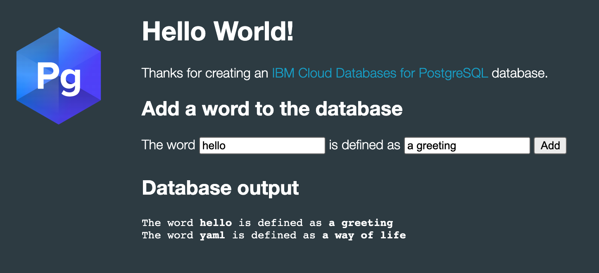

## Activity description

In this excercise, you will configure an application to write data to a PostgreSQL database running in the IBM Cloud. This activity will use the following items:

1. An instance of a postgress database
1. A Kubernetes cluster

### Extra credit

In the extra credit part of this excercise, you will build an image for the application, push it to the IBM Container Registry, and define your yaml so it pulls the image from the IBM Container Registry. For this activity you will also need:

1. An IBM Cloud login
1. The resource group for your access to the IBM Container Registry
1. Access to the IBM Container Registry

**Note:** This lab is based on code from [https://github.com/IBM-Cloud/clouddatabases-helloworld-kubernetes-examples](https://github.com/IBM-Cloud/clouddatabases-helloworld-kubernetes-examples) We are using the code from the [postgres section.](https://github.com/IBM-Cloud/clouddatabases-helloworld-kubernetes-examples/tree/node/postgresql)

## Prerequisites

See the [Prerequisites section](/prerequisites) for the prerequisites for this lab.

## Information required to complete this lab

Write down each of these before you begin this exercise. You must know these values to complete this lab.
1. Kubernetes cluster name: <br/>[cluster_name]<hr/>
1. Postgres database name: <br/>[database_name]<hr/>
1. Kubernetes secret to access the database: <br/>[path-to-secret_name]<hr/>

## Activity

### Add the Kubernetes secret to your cluster 

**Note:** If your database uses both public and private endpoints, your public endpoint will be used by default. Therefore, if you want to select the private endpoint, first you will need to create a service key for your database so Kubernetes can use it when binding to the database.

For this lab the key has been created. **Note:** You should download the `postgress-secret.yaml` file to the current directory. You'll bind the database to the Kubernetes cluster by applying a yaml file. Apply the secrets yaml file with the command:

```
kubectl apply -f postgress-secret.yaml
```

This will create a secret in your Kubernetes cluster using the database's private endpoint from the key you've created above.

Verify that the Kubernetes secret was created in your cluster namespace. Kubernetes uses secrets to store confidential information like the IBM Cloud Identity and Access Management (IAM) API key and the URL that the container uses to gain access. Running the following command, you'll get the API key for accessing the instance of your Databases for PostgreSQL service that's provisioned in your account.

```
kubectl get secrets
```
### Create a yaml file to deploy the application

Take a look at the yaml file below. Save this file as `clouddb-deployment.yaml`
```
apiVersion: apps/v1
kind: Deployment
metadata:
  name: icdpostgres-app
spec:
  replicas: 1
  selector:
    matchLabels:
      run: clouddb-demo
  template:
    metadata:
      name: icdpostgres-app
      labels:
        run: clouddb-demo
    spec:
      containers:
        - name: cloudpostgres-nodejs-app
          image: docker.io/ibmcase/icdpg:1.0
          imagePullPolicy: Always
          env:
            - name: BINDING
              valueFrom:
                secretKeyRef:
                  name: binding-postgressql-cloudnative-bootcamp
                  key: binding
---
apiVersion: v1
kind: Service
metadata:
  name: cloudpostgres-service
  labels:
    run: clouddb-demo
spec:
  type: NodePort
  selector:
    run: clouddb-demo
  ports:
    - protocol: TCP
      port: 8080
```
### Examine the yaml file

You should notice several things in this yaml file.

The image is pulled from [docker hub](https://hub.docker.com/repository/docker/ibmcase/icdpg) Notice the `spec` section contains the name of the image:

```
    spec:
      containers:
      - name: cloudpostgres-nodejs-app
        image: docker.io/ibmcase/icdpg:1.0 
```


Under `secretKeyRef` section, notice the name `binding-postgressql-cloudnative-bootcamp` this matches the name of the secret that was generated for the IBM Cloud Databases for PostgreSQL This secret was provided to you in the `postgress-secret.yaml` file.

```
secretKeyRef:
  name: binding-postgressql-cloudnative-bootcamp 
```


### Apply the yaml file

Deploy the application to your Kubernetes cluster. When you deploy the application, it will automatically be bound to your Kubernetes cluster.

```
kubectl apply -f clouddb-deployment.yaml
```

Describe the deployment
```
kubectl describe deployment icdpostgres-app
```

Check on the pod that was created:
```
kubectl get pod -l run=clouddb-demo
```

Get the URL for the application. Use the code below to get the URL for the apllication:

```
EXTERNAL_IP=$(kubectl get nodes -o jsonpath='{.items[0].status.addresses[?(@.type=="ExternalIP")].address}')
NODEPORT="$(kubectl get svc cloudpostgres-service -o jsonpath='{.spec.ports[0].nodePort}')"
echo URL=http://$EXTERNAL_IP:$NODEPORT
```


Now you can access the application from the Public IP and NodePort of the app. Try the URL from your browser.

The clouddatabases-postgresql-helloworld app displays the contents of an examples database. To demonstrate that the app is connected to your service, add some words to the database. The words are displayed as you add them, with the most recently added words displayed first.




## Extra credit

In this section you will use the IBM Cloud Registry to store the image. You will build the image but you do not need Docker Desktop. The build will happen on the IBM Cloud.

### Login in to the IBM Cloud from the command line

Connect to IBM Cloud in the command line tool and follow the prompts to log in.

```
ibmcloud login
```

**Note:** If you have a federated user ID, use the `ibmcloud login --sso` command to log in with your single sign on ID.

Make sure you are targeting the correct IBM Cloud resource group of your IBM Cloud Kubernetes Service.

Use the following command to target your cluster resource group if your resource group is other than default.

```
ibmcloud target -g [resource_group_name]
```

### Create a namespace to store your image

Create your own private image repository in IBM Cloud Container Registry to store your application's Docker image. Since we want the images to be private, we need to create a namespace, which will create a unique URL to your image repository. **Note:** Use your initials to make the namespace unique and easier to find.

You can create a namespace with the command: 

```
ibmcloud cr namespace-add [your-initials]-cloud-native
```

You can see a list of all namespaces with:

```
ibmcloud cr namespaces
```

Clone the app to your local environment from your terminal using the following command:

```
git clone -b node https://github.com/IBM-Cloud/clouddatabases-helloworld-kubernetes-examples.git
cd clouddatabases-helloworld-kubernetes-examples/postgresql
```

`cd` into this newly created directory `clouddatabases-helloworld-kubernetes-examples`, and `cd` into the `postgresql` folder. The code for connecting to the service, and reading from and updating the database can be found in server.js. See Code Structure and the code comments for information on the app's functions. There's also a public directory, which contains the html, style sheets and JavaScript for the web app. But, to get the application working, we'll first need to push the Docker image of this application to our IBM Cloud Container Registry.

Build and push the application's Docker image to your IBM Cloud Container Registry. We're calling this container icdpg. **Note:** There is a period (dot) at the end of the following command.

Check the region where you registry is located in our example we use `us-south` and the registry hostname is `us.icr.io`

```
ibmcloud cr build -t us.icr.io/[your_namespace]/icdpg .
```

After it's built, you can view the image in container registry using:

```
ibmcloud cr images
```

You'll get something like the following response:
```
REPOSITORY                       TAG      DIGEST         NAMESPACE   CREATED       SIZE    SECURITY STATUS
us.icr.io/[namespace]/icdpg         latest   81c3959ea657   [namespace] 4 hours ago   28 MB   No Issues
```


## Code Structure

### File	Description

- server.js	Establishes a connection to the PostgreSQL database using credentials from BINDING (the name we created in the Kubernetes deployment file to expose the PostgreSQL credentials) and handles create and read operations on the database.
- main.js	Handles user input for a PUT command and parses the results of a GET command to output the contents of the PostgreSQL database.

## REST - The app uses a PUT and a GET operation:

- PUT

-- takes user input from main.js
-- uses the client.query method to add the user input to the words table
- GET

-- uses client.query method to retrieve the contents of the words table
-- returns the response of the database command to main.js
