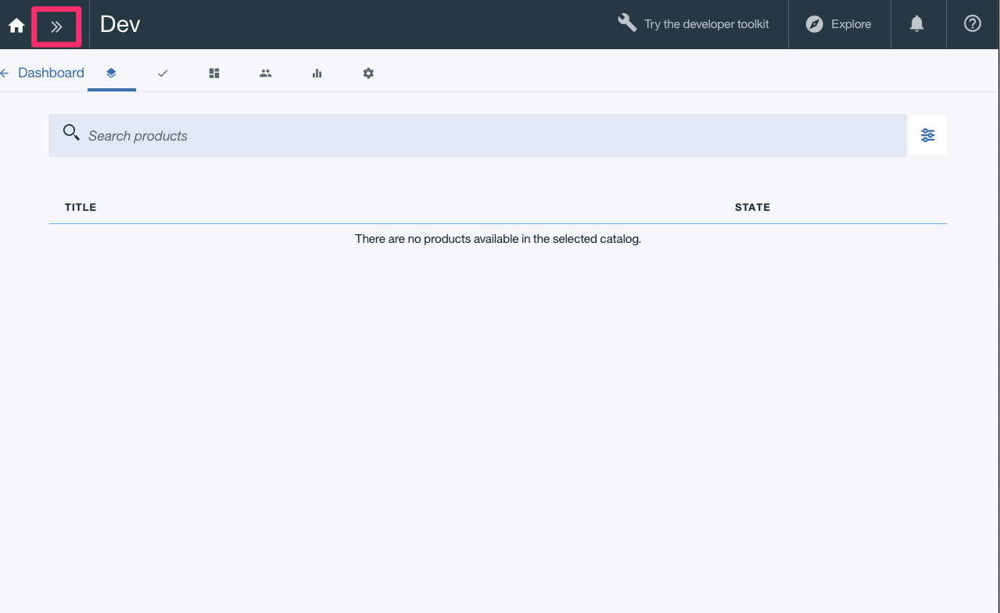
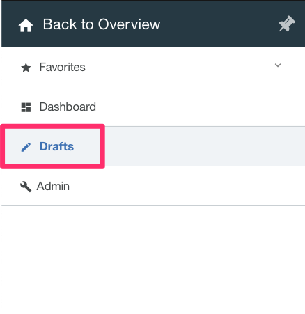
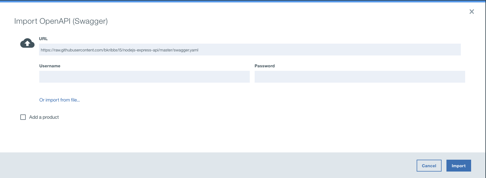
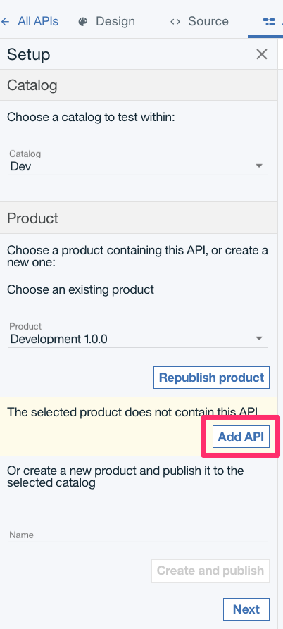
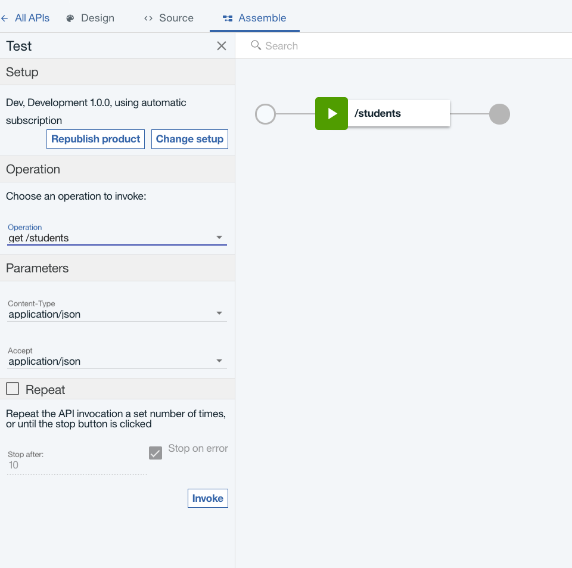
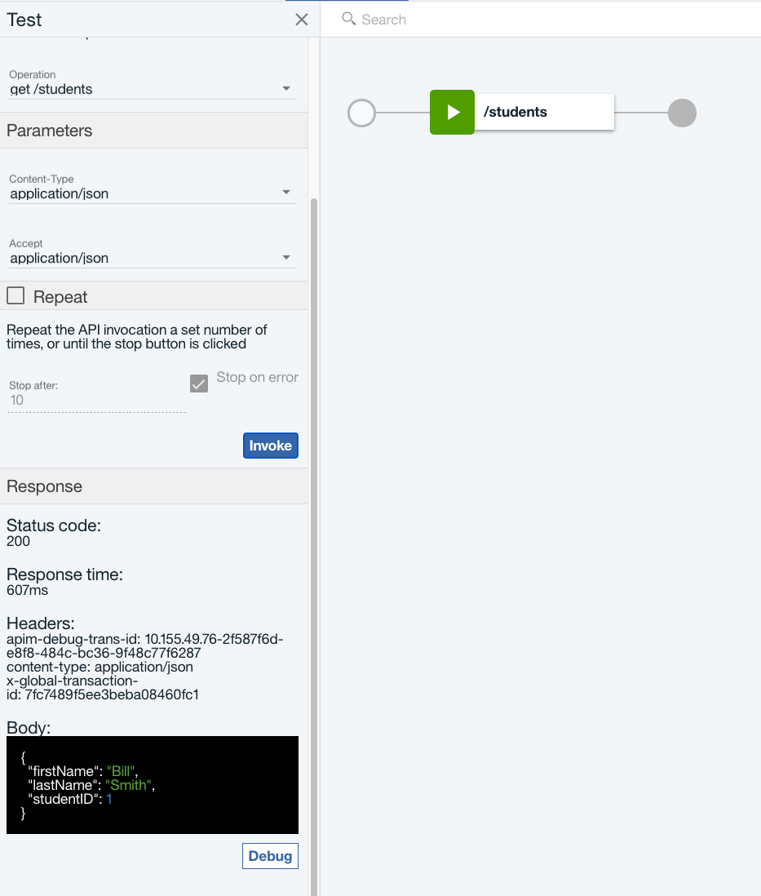

To setup API Connect follow the instructions for [API Connect Access](./accessAPI).

## Create a New Catalog 

- Once logged in, we will be on the API Connect Dashboard.

- Click the `Add` button in the upper left corner and select `Catalog`.

- Name your catalog whatever you like, in this case we are using `Dev`.

- We will be using this catalog for all of our tutorials.

## Create a New Product

- Start by clicking on your catalog name from the main dashboard.

- Click on the top left arrows button next to the catalog name.

- Next, Select `Drafts`.

- On the `Drafts` page, click on the `Add` button in the top left side. Then click `New Product`.

- Fill in the `Product` info with the following:
    - Title: `Development`
    - Name: `Test`
    - Version: `1.0.0`

- Now a new Product named `Test` has been created. On the `Design` page all the details about the product can be changed.

## Importing a New API

- With a product created, now we can create a new API for that product.

- Navigate back to the `Drafts` page.

- Click on the top left arrows button next to the catalog name.

- Next, Select `Drafts`.

- Once on the `Drafts` page, Click on the `API's` tab in the top left.

- Click `Add` -> `Import API from a file or URL`

- Next Click `Or import from URL...`

- Now in the `URL` paste `https://raw.githubusercontent.com/bkribbs15/nodejs-express-api/master/swagger.yaml`. Nothing is needed for the `Username` and `Password`, so click `Import`.

- The API will now be imported in and you will be taken to the `Design` page of the API.

## Testing the New API

- To test the newly imported API, go to the `Assemble` page.

- Now you will see all the operations that were imported in, and we can start the test by clicking the `test` button.

- The API hasn't been added to the `Product` yet, so click on `Add API`.

- Then `Republish` your `Product` in order for the API to go live.

- Now we can choose an `Operation` to invoke. For the first one we will pick `/students`.

- With the operation chosen we can add any parameters the API would need, but in this case we don't need any so we can just press `Invoke`.

- If everything is successful we will see response with a status of `200` and a JSON object like the one below. 

- That's it. We have successfully imported an API. Try out the other operations as well.

