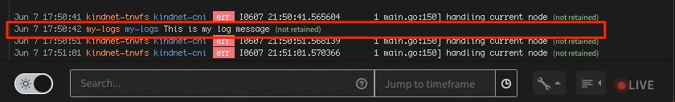
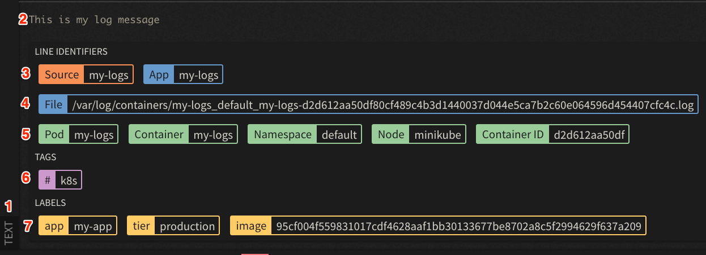
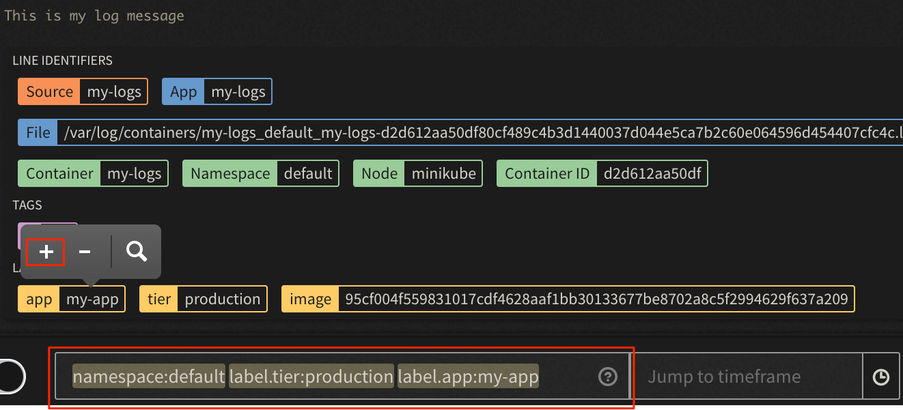
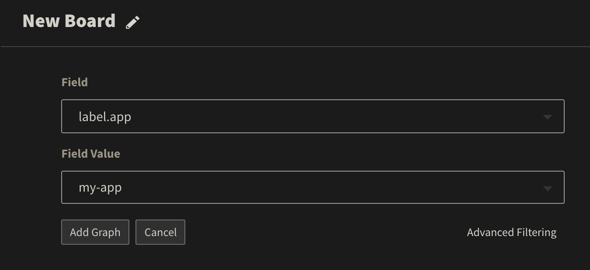
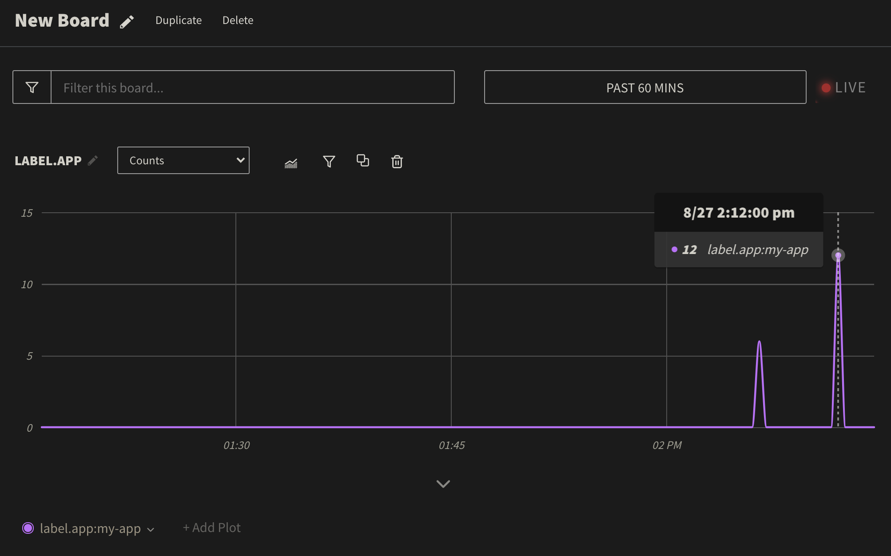

### Prerequisite
- Configure the LogDNA Agent on a kubernetes cluster, you can use one of the labs in this bootcamp located [here](/monitoring/logdna/#activities)

## Deploy sample App

- Open LogDNA
- Select Views
- Kubernetes messages should show up
- To test simple log messages create a Pod with bash prompt
    ```
    kubectl run my-logs \
      --rm -it \
      -l "app=my-app,tier=production" \
      --image=busybox \
      -- sh
    ```
- Print a log message
    ```bash
    echo "This is my log message"
    ```

## Filtering Logs

- Identify your message at the bottom of the screen



- Click the log line to expand


- The message has details that could be use to create views, alerts, or boards
1. The message was identified as `TEXT`
1. Contains the message
1. LogDNA fields `Source` and `App`
1. Location of filed parsed, in kubernetes this is `var/log`
1. Kubernetes data `Pod`, `Container`, `Namespace`, and `ContainerID`
1. LogDNA tagging as kubernetes `k8s`
1. Pod labels are captured in this case `app` and `tier`



- You can use free form text to search or filter log lines, or you can click on on values from a message to filter. For example to filter to only get the message for the namespace `default`, tier `production` and app `my-app



- When you hit enter only the log lines for your app will show up

- You can create a filtered view for your search query, click on `Unsaved View` and click `Save as new view`, enter the name `My App`


- Now you can use select the view `My App` from the sidebar to filter the messages only to your app.

- See [Filtering Logs](https://docs.logdna.com/docs/filters)
- See [Creating Views](https://docs.logdna.com/docs/views)

## Creating Boards Boards and Graphs

**Boards** are a collection of graphs. Typically you use this to aggregate metrics about your log lines or query or plots over time.

- Click `Boards`
- Click `NEW BOARDS`
- Name your Board `My Board`
- Click `Add Graph`
- Select query like `pod` = `my-logs`



- Click `Live` to see the graph for the current time




- See [Creating Boards and Graphs](https://docs.logdna.com/docs/graphs)
