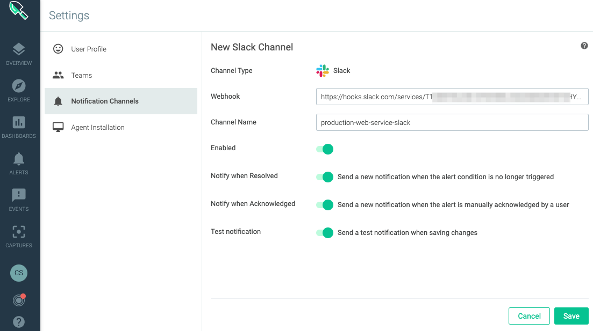
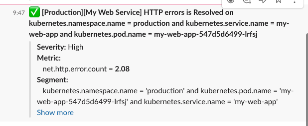
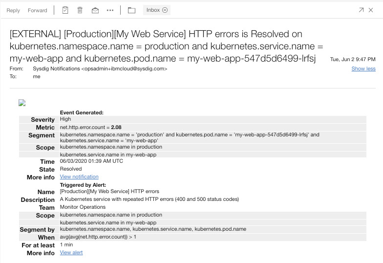
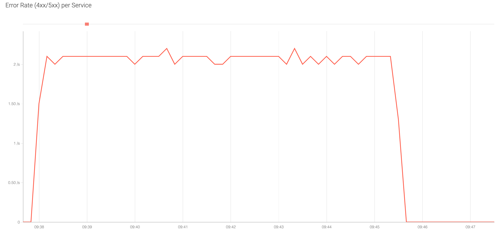

### Prerequisite
- Configure Dashboards following the lab [here](/electives/monitoring/sysdig/#activities)


## Create Email Notification Channel
- Open Sysdig
- Go to Settings
- Select "Notifications Channel"
- Click "Add Notification Channel"
- Select Email
- Enter email address, this can be a functional id
- Enter a Channel name this will be use when setting up channels `production-web-service-sev-high-email`


## Create Slack Notification Channel
- Open Sysdig
- Go to Settings
- Select "Notifications Channel"
- Click "Add Notification Channel"
- Select Slack
- Enter Slack Incoming Webook URL. You can create a free slack workspaces for testing purposes for this lab. Once you have a Slack workspace you can create a Slack App with Incomig webhook [here](https://api.slack.com/messaging/webhooks)
- Enter a Channel name this will be use when setting up channels `production-web-service-sev-high-slack`. This is not the Slack Channel, is a "Sysdig" Alert Channel.




## Create Alert for HTTP errors
- Open Sysdig
- Select Alerts


- Click Add Alert
- Select Metric
- Name it `[Production][My Web Service] HTTP errors`
- Change to High
- Select metric `Average` of `net.http.error.count`
- Edit Scope
    - `kubernetes.namespace.name` in `production`
    - `kubernetes.service.name` in `my-web-app`
- Edit Trigger 
    - To make it trigger faster for demo purposes set to metric `>` `1` for `1 minute`
- Enable Notification Channels
    - Enable Email `production-web-service-sev-high-email`
    - Enable Slack `production-web-service-sev-high-slack`
- Click Save
- Enable the Alert


## Trigger an Alert with HTTP errors
- Simulate HTTP Errors by calling the web service with the following command.
```shell
while true; do sleep 0.1; curl http://localhost:8081/status/500 -si | head -1 ; done
```
- Go to the dashboard `Kubernetes Service Golder Signals - My Web Service` select a 10S time window and Maximize the panel `Error Rate (4xx/5xx) per Service`


- You can see that the problem was detected and an alert triggered.

## Receiving Alert Notifications

- Slack Notification is received alerting about the http errors


- Email Notification is received alerting about the http errors


## Receiving Resolution Notifications

- Stop the HTTP Error simulation, and the system will send another notificatoon about the resolution

- Another Slack Notification is received when the problem is resolved



- Another Email Notification is received when the problem is resolved



- You can see in the Golden Signal Dashboard for Error Rate that rates go back to zero



## Events 

- To see all events collected click Events on Sysdig


