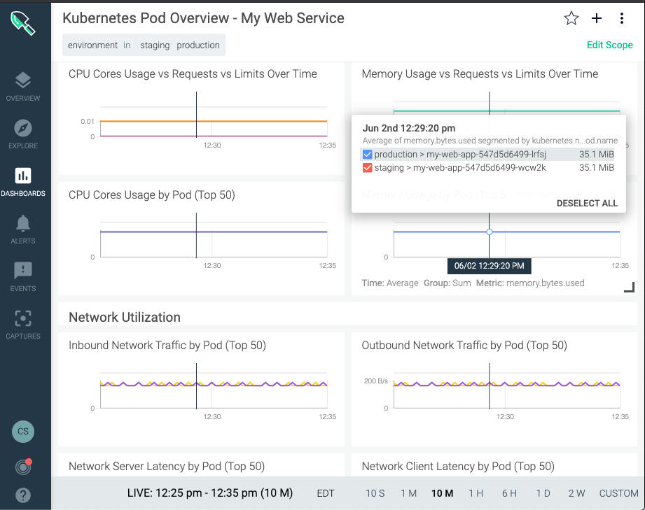
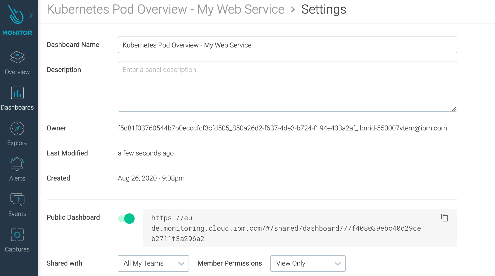

### Prerequisite

- Configure the Sysdig Agent on a kubernetes cluster, you can use one of the labs in this bootcamp located [here](/monitoring/sysdig/#activities)


## Setup Environment
- Create two namespaces
```shell
kubectl create ns staging
kubectl create ns production
```

- Deploy web service to both namspaces
```shell
kubectl -n staging create deployment my-web-app --image=docker.io/kennethreitz/httpbin
kubectl -n staging create svc nodeport my-web-app --tcp=8080:80
kubectl -n production create deployment my-web-app --image=docker.io/kennethreitz/httpbin
kubectl -n production create svc nodeport my-web-app --tcp=8080:80
```

- Send load to each web service, run each command in a different terminal
```shell
kubectl -n staging port-forward service/my-web-app 8080:8080
```
```shell
kubectl -n production port-forward service/my-web-app 8081:8080
```
```shell
while true; do sleep 1; curl http://localhost:8080/status/200 -si | head -1 ; done
```
```shell
while true; do sleep 1; curl http://localhost:8081/status/200 -si | head -1 ; done
```

## Create Dashboard "Kubernetes Service Golden Signals" 
- Select Dashboards -> Default Templates -> Kubernetes Service Golden Signals
- On the top right menu select "Create Custom Dashboard"
- Name the new dashboard `Kubernetes Service Golden Signals - My Web Service`
- Click Create and Open
- Click Edit Scope
- Select `kubernetes.namespace.name` `in` `production`
- Click Save
- Click the star icon to add to favorites


## Create Dashboard "Kubernetes Pod Overview" 
- Select Dashboards -> Default Templates -> Kubernetes -> Kubernetes Pod Overview
- On the top right menu select "Copy Dashboard"
- Name the new dashboard `Kubernetes Pod Overview - My Web Service`
- Click Edit Scope
- Select `kubernetes.namespace.name` `in` `staging` `production`
- Click Save
- Click the star icon to add to favorites



## Sharing Dashboard
- Select one of your Dashboards
- Click the top right menu select "Dashboard Settings"
- Enable Public Dashboard
- You can share just with your team or as public url


