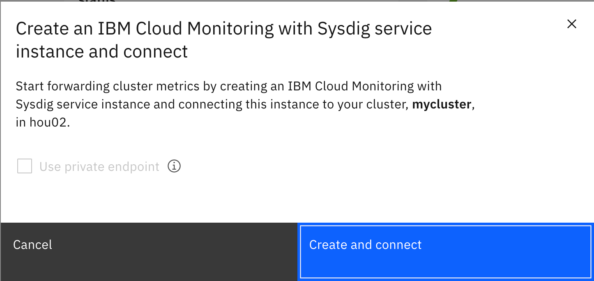

### Prerequisite
- Create an IBM Kubernetes Cluster, it can be a Cluster using the Free plan

### Connecting a Sysdig agent to a standard Kubernetes cluster

1. Open you Kubernetes Cluster Overview, in the Summary find _Monitoring__ row and click **Connect**
    
1. Click **Create and connect**
    
1. Select a Sysdig plan such as **Free** and click **Create**
1. Verify Cluster is connected to Sysdig service instance by clicking the button **Launch** next to __Monitoringg__
    

- For more information on configuring and using the Sysdig Agent on your Cluster:
    -  [Monitorting a Kubernetes cluster](https://cloud.ibm.com/docs/Monitoring-with-Sysdig?topic=Monitoring-with-Sysdig-kubernetes_cluster)
