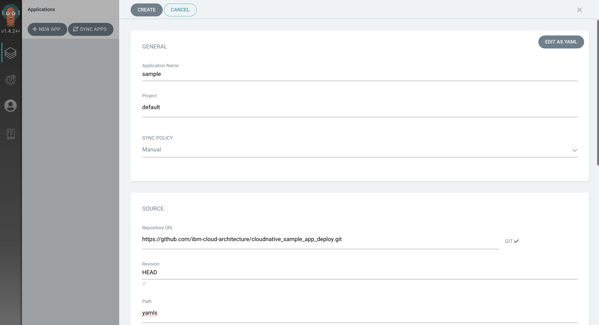
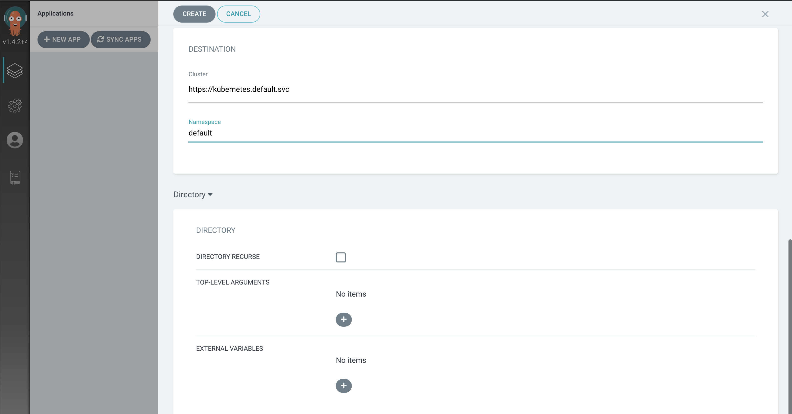
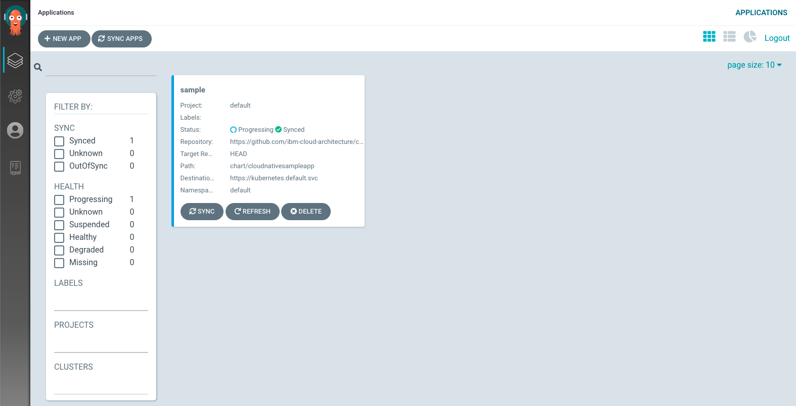

## Pre-requisites

Make sure your environment is setup properly for the lab.

Check the [Environment Setup](../prerequisites/#environment-setup) page for your setup.

## ArgoCD Installation

- Create the namespace `argocd` to install argocd
    ```bash
    oc new-project argocd
    ```
- Install ArgoCD as follows.
    ```
    oc apply --filename https://raw.githubusercontent.com/ibm-cloud-architecture/learning-cloudnative-101/master/static/yamls/argo-lab/argocd-operator.yaml
    ```
- When installing the tutorial, make sure you wait until the argocd-operator is finished before installing the argocd-cr..or it will fail. You can do this:
    ```bash
    oc get ClusterServiceVersion -n argocd
    NAME                                   DISPLAY                        VERSION   REPLACES   PHASE
    argocd-operator.v0.0.8                 Argo CD                        0.0.8                Succeeded
    ```
    and wait for the "succeeded" to come up before proceeding.
    ```
    oc apply --filename https://raw.githubusercontent.com/ibm-cloud-architecture/learning-cloudnative-101/master/static/yamls/argo-lab/argocd-cr.yaml
    ```
    and wait for the argocd server Pod to be running
    ```
    oc get pods -n argocd -l app.kubernetes.io/name=example-argocd-server
    ```
    ```
    NAME                                     READY   STATUS    RESTARTS   AGE
    example-argocd-server-57c4fd5c45-zf4q6   1/1     Running   0          115s
    ```
- Install the `argocd` CLI, for example on OSX use brew
    ```bash
    brew tap argoproj/tap
    brew install argoproj/tap/argocd
    ```
- Set an environment variable `ARGOCD_URL` using the `EXTERNAL-IP`
    ```bash
    export ARGOCD_NAMESPACE="argocd"
    export ARGOCD_SERVER=$(oc get route example-argocd-server -n $ARGOCD_NAMESPACE -o jsonpath='{.spec.host}')
    export ARGOCD_URL="https://$ARGOCD_SERVER"
    echo ARGOCD_URL=$ARGOCD_URL
    echo ARGOCD_SERVER=$ARGOCD_SERVER
    ```

## Deploying the app

- Login into the UI.
    ```bash
    open $ARGOCD_URL
    ```
- Use `admin` as the username and get the password with the following command
    ```bash
    oc get secret example-argocd-cluster -n $ARGOCD_NAMESPACE -o jsonpath='{.data.admin\.password}' | base64 -d
    ```
    For example the output is similar to this:
    ```
    tyafMb7BNvO0kP9eizx3CojrK8pYJFQq
    ```


- Now go back to the ArgoCD home and click on `NEW APP`.
- Add the below details:
- Application Name: `sample`
- Project - `default`
- SYNC POLICY: `Manual`
- REPO URL: `https://github.com/ibm-cloud-architecture/cloudnative_sample_app_deploy`
- Revision: `HEAD`
- Path: `openshift`



- Cluster - Select the default one `https://kubernetes.default.svc` to deploy in-cluster
- Namespace - `default`
- Click Create to finish



- You will now see the available apps.


- Initially, the app will be out of sync. It is yet to be deployed. You need to sync it for deploying.

To sync the application, click `SYNC` and then `SYNCHRONIZE`.


- Wait till the app is deployed.



- Once the app is deployed, click on it to see the details.


## Verifying the deployment

- Access the app to verify if it is correctly deployed.
- List the cloudnativesampleapp-service route
    ```
    oc get route
    ```
    It should have an IP under `EXTERNAL-IP` column
    ```
    NAME                 HOST/PORT                                     PATH   SERVICES                       PORT   TERMINATION   WILDCARD
    cloudnative-sample   cloudnative-sample-default.apps-crc.testing          cloudnativesampleapp-service   9080                 None
    ```
- Set an environment variable `APP_URL` using the `EXTERNAL-IP`
    ```
    export APP_URL="http://$(oc get route cloudnative-sample -o jsonpath='{.status.ingress[0].host}')"
    echo ARGOCD_SERVER=$APP_URL
    ```
- Access the url using `curl`
    ```
    curl "$APP_URL/greeting?name=Carlos"
    ```
    ```
    {"id":2,"content":"Welcome to Cloudnative bootcamp !!! Hello, Carlos :)"}
    ```

## Using the ArgoCD CLI

- Login using the cli.
- Use `admin` as the username and get the password with the following command
    ```bash
    export ARGOCD_PASSWORD=$(oc get secret example-argocd-cluster -n $ARGOCD_NAMESPACE -o jsonpath='{.data.admin\.password}' | base64 -d)
    echo $ARGOCD_PASSWORD
    ```
- Now login as follows.
    ```bash
    argocd login --username admin --password $ARGOCD_PASSWORD $ARGOCD_SERVER
    ```
    ```
    WARNING: server certificate had error: x509: cannot validate certificate for 10.97.240.99 because it doesn't contain 
    any IP SANs. Proceed insecurely (y/n)? y

    'admin' logged in successfully
    Context 'example-argocd-server-argocd.apps-crc.testing' updated
    ```
- List the applications
    ```bash
    argocd app list
    ```
    ```
    NAME    CLUSTER                         NAMESPACE  PROJECT  STATUS  HEALTH   SYNCPOLICY  CONDITIONS  REPO                                                                     PATH   TARGET
    sample  https://kubernetes.default.svc  default    default  Synced  Healthy  <none>      <none>      https://github.com/ibm-cloud-architecture/cloudnative_sample_app_deploy  openshift  HEAD
    ```
- Get application details
    ```bash
    argocd app get sample
    ```
    ```
    Name:               sample
    Project:            default
    Server:             https://kubernetes.default.svc
    Namespace:          default
    URL:                https://10.97.240.99/applications/sample
    Repo:               https://github.com/ibm-cloud-architecture/cloudnative_sample_app_deploy
    Target:             HEAD
    Path:               openshift
    SyncWindow:         Sync Allowed
    Sync Policy:        <none>
    Sync Status:        Synced to HEAD (9684037)
    Health Status:      Healthy

    GROUP  KIND        NAMESPACE  NAME                             STATUS  HEALTH   HOOK  MESSAGE
        Service     default    cloudnativesampleapp-service     Synced  Healthy        service/cloudnativesampleapp-service created
    apps   Deployment  default    cloudnativesampleapp-deployment  Synced  Healthy        deployment.apps/cloudnativesampleapp-deployment created
    ```
- Show application deployment history
    ```bash
    argocd app history sample
    ```
    ```
    ID  DATE                           REVISION
    0   2020-02-12 21:10:32 -0500 EST  HEAD (9684037)
    ```
## References

- [ArgoCD](https://argoproj.github.io/argo-cd/)