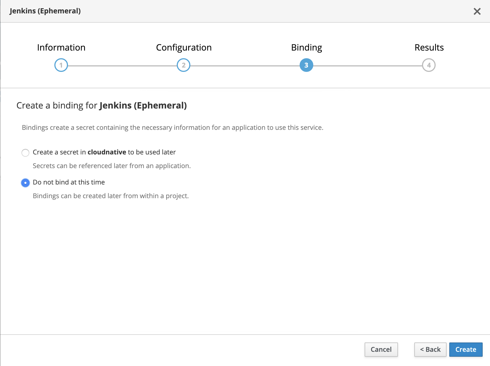
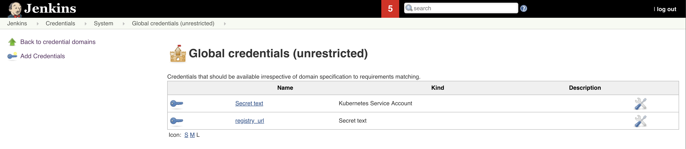

## Introduction

In this lab, you will learn about how to define Continuous Integration for your application. We are using https://jenkins.io/[Jenkins] to define it.

**Jenkins**

Jenkins is a popular open source Continuous Integration tool. It is built in Java. It allows the developers to perform continuous integration and build automation. It allows you to define steps and executes them based on the instructions like building the application using build tools like Ant, Gradle, Maven etc, executing shell scripts, running tests etc. All the steps can be executed based on the timing or event. It depends on the setup. It helps to monitor all these steps and sends notifications to the team members in case of failures. Also, it is very flexible and has a large plugin list which one easily add based on their requirements.

Check these guides out if you want to know more about Jenkins - https://jenkins.io/doc/[Jenkins, Leading open source automation server].

## Prerequisites

- You need an https://cloud.ibm.com/login[IBM cloud account].
- Create kubernetes cluster using https://cloud.ibm.com/docs/containers?topic=containers-getting-started[IBM Cloud Kubernetes Service]. Here, you can choose a kubernetes cluster.
- Install https://kubernetes.io/docs/tasks/tools/install-kubectl/[kubectl] command line tool.
- You should be familiar with basics like Containers, Docker, Kubernetes.

## Continuous Integration

### Install Jenkins

- Initially log in into your ibm cloud account as follows.

```bash
$ ibmcloud login -a cloud.ibm.com -r (region) -g (cluster_name)
```

And then download the Kube config files as below.

```bash
$ ibmcloud ks cluster-config --cluster (cluster_name)
```

You can also get the `access` instructions in `IBM Cloud Dashboard -> Kubernetes Clusters -> Click on your Cluster -> Click on Access Tab`.

- Install Jenkins using helm using the below command. We are not using persistence in this lab.

```bash
$ helm install --name cloudnative-jenkins --set persistence.enabled=false stable/jenkins
```

If it is successfully executed, you will see something like below.

```bash
$ helm install --name cloudnative-jenkins --set persistence.enabled=false stable/jenkins
NAME:   cloudnative
LAST DEPLOYED: Wed Aug  7 16:22:55 2019
NAMESPACE: default
STATUS: DEPLOYED

RESOURCES:
==> v1/ConfigMap
NAME                       DATA  AGE
cloudnative-jenkins        5     1s
cloudnative-jenkins-tests  1     1s

==> v1/Deployment
NAME                 READY  UP-TO-DATE  AVAILABLE  AGE
cloudnative-jenkins  0/1    1           0          1s

==> v1/Pod(related)
NAME                                  READY  STATUS    RESTARTS  AGE
cloudnative-jenkins-57588c86c7-hxqmq  0/1    Init:0/1  0         0s

==> v1/Role
NAME                                 AGE
cloudnative-jenkins-schedule-agents  1s

==> v1/RoleBinding
NAME                                 AGE
cloudnative-jenkins-schedule-agents  1s

==> v1/Secret
NAME                 TYPE    DATA  AGE
cloudnative-jenkins  Opaque  2     1s

==> v1/Service
NAME                       TYPE          CLUSTER-IP      EXTERNAL-IP     PORT(S)         AGE
cloudnative-jenkins        LoadBalancer  172.21.143.35   169.63.132.124  8080:32172/TCP  1s
cloudnative-jenkins-agent  ClusterIP     172.21.206.235  (none>          50000/TCP       1s

==> v1/ServiceAccount
NAME                 SECRETS  AGE
cloudnative-jenkins  1        1s
```

Use the following steps to open Jenkins UI and login.

```
NOTES:
1. Get your 'admin' user password by running:
  printf $(kubectl get secret --namespace default cloudnative-jenkins -o jsonpath="{.data.jenkins-admin-password}" | base64 --decode);echo
2. Get the Jenkins URL to visit by running these commands in the same shell:
  NOTE: It may take a few minutes for the LoadBalancer IP to be available.
        You can watch the status of by running 'kubectl get svc --namespace default -w cloudnative-jenkins'
  export SERVICE_IP=$(kubectl get svc --namespace default cloudnative-jenkins --template "{{ range (index .status.loadBalancer.ingress 0) }}{{ . }}{{ end }}")
  echo http://$SERVICE_IP:8080/login

3. Login with the password from step 1 and the username: admin


For more information on running Jenkins on Kubernetes, visit:
https://cloud.google.com/solutions/jenkins-on-container-engine
#################################################################################
######   WARNING: Persistence is disabled!!! You will lose your data when   #####
######            the Jenkins pod is terminated.                            #####
#################################################################################

```

To get the url, run the below commands.

```bash
$ export SERVICE_IP=$(kubectl get svc --namespace default cloudnative-jenkins --template "{{ range (index .status.loadBalancer.ingress 0) }}{{ . }}{{ end }}")
$ echo http://$SERVICE_IP:8080/login
```

Once executed, you will see something like below.

```bash
$ echo http://$SERVICE_IP:8080/login
http://169.63.132.124:8080/login
```

- Now, let us login into the Jenkins.



The user name will be `admin` and to get the password, run the below command.

```bash
$ printf $(kubectl get secret --namespace default cloudnative-jenkins -o jsonpath="{.data.jenkins-admin-password}" | base64 --decode);echo
```

It returns you the password as follows.

```bash
$ printf $(kubectl get secret --namespace default cloudnative-jenkins -o jsonpath="{.data.jenkins-admin-password}" | base64 --decode);echo
password
```

- Once, successfully logged in you will see the Jenkins home page which is as follows.


### Get the Sample App

- Fork the below repository.

    https://github.com/ibm-cloud-architecture/cloudnative_sample_app


- Clone the forked repository.

```bash
$ git clone https://github.com/(user)/cloudnative_sample_app.git
```

### Jenkinsfile

Before setting up the CI pipeline, let us first have a look at our Jenkinsfile and understand the stages here.

Open your Jenkinsfile or you can also access it https://github.com/ibm-cloud-architecture/cloudnative_sample_app/blob/master/Jenkinsfile[here].

In our Jenkins file, we have five stages.

- *Local - Build*

In this stage, we are building the application and packaging it using maven.

- *Local - Test*

In this stage, we are making all the unit tests are running fine by running maven test.

- *Local - Run*

In this stage, we are running the application using the previous build and verifying the application performing health and api checks.

- *Build and Push Image*

  * We are logging in to the IBM Cloud and accessing the IBM Cloud Container Registry.
  * We are also creating a namespace if not present.
  * We are building the image using ibmcloud cli tools.
  * Once the image is built, it is pushed into the container registry.

In this stage, we are building the docker image and pushing it to the registry.

- *Push to Deploy repo*

  * Initially, we are cloning the deploy repository.
  * Changing the image tag to the one we previously built and pushed.
  * Pushing this new changes to the deploy repository.

In this stage, we are pushing the new artifact tag to the deploy repository which will later be used by the Continuous Delivery system.

### Jenkins Credentials

Let us now build all the credentials required by the pipeline.

- In the Jenkins home page, click on `Credentials`.


- In the Credentials page, click on `Jenkins`.


- Now, click on `Global Credentials (UnRestricted)`.


- Click on `Add Credentials` to create the ones required for this lab.


- Now create a secrets as follows.

----
Kind : Secret Text
Secret: Your container registry url, for eg., us.icr.io
ID: registry_url
----


Once created, you will see something like below.



Similarly create the rest of the credentials as well.

----
Kind : Secret Text
Secret: (Your registry namespace, for eg., catalyst_cloudnative)
ID: registry_namespace

Kind : Secret Text
Secret: (Your IBM cloud region, for eg., us-east)
ID: ibm_cloud_region

Kind : Secret Text
Secret: (Your IBM Cloud API key)
ID: ibm_cloud_api_key

Kind : Secret Text
Secret: (Your Github Username)
ID: git-account

Kind : Secret Text
Secret: (Your Github Token)
ID: github-token
----

Once all of them are created, you will have the list as follows.


### Jenkins Pipeline

- Create a new pieline. Go to Jenkins ) Click on `New Item`.


- Enter the name of your application, select `Pipeline` and then click `OK`.


- In `General`, check `This project is parameterized`. Create a string parameter with name `CLOUD` and Default value `kubernetes`.


- Now go to the `Pipeline` tab and enter the details of the repository.

  * In the Definition, choose `Pipeline script from SCM`.
  * Mention SCM as `Git`.
  * Enter the repository URL in `Repository URL`.
  * Specify `master` as the branch to build.
  * `Save` this information.


- To initiate a build, click `Build with Parameters`.


- Once the build is successful, you will see something like below.


After this build is done, your deploy repository will be updated by the Jenkins.


