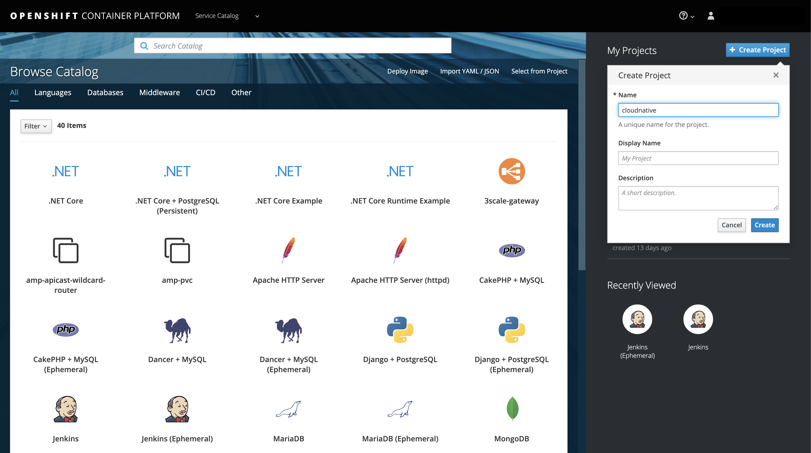
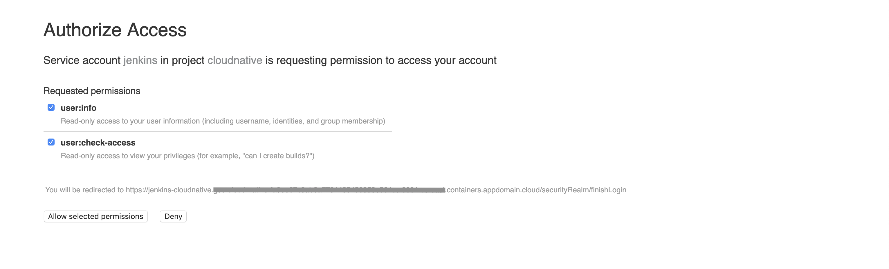
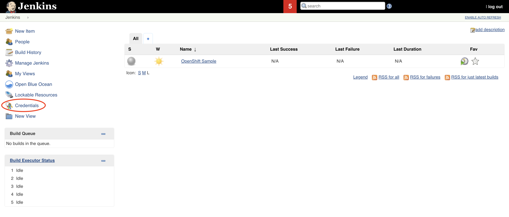

## Introduction

In this lab, you will learn about how to define Continuous Integration for your application. We are using [Jenkins](https://jenkins.io/) to define it.

**Jenkins**

Jenkins is a popular open source Continuous Integration tool. It is built in Java. It allows the developers to perform continuous integration and build automation. It allows you to define steps and executes them based on the instructions like building the application using build tools like Ant, Gradle, Maven etc, executing shell scripts, running tests etc. All the steps can be executed based on the timing or event. It depends on the setup. It helps to monitor all these steps and sends notifications to the team members in case of failures. Also, it is very flexible and has a large plugin list which one easily add based on their requirements.

Check these guides out if you want to know more about Jenkins - [Jenkins](https://jenkins.io/doc/), Leading open source automation server.

## Prerequisites

- You need an [IBM cloud account](https://cloud.ibm.com/login).
- Create kubernetes cluster using [IBM Cloud Kubernetes Service](https://cloud.ibm.com/docs/containers?topic=containers-getting-started). Here, you can choose an openshift cluster.
- Install [oc](https://www.okd.io/download.html) command line tool.
- You should be familiar with basics like Containers, Docker, Kubernetes.

## Continuous Integration

### Install Jenkins

- Open the IBM Cloud Openshift cluster.


- Click on the `OpenShift web console` tab and this will take you to openshift UI.


- Create a new project.



- Search for `Jenkins`.


- Choose `Jenkins (Ephemeral)`.


- Install it.


- Wait till the Jenkins installs and the pods are ready.


- Once, it is ready you can access the Jenkins by clicking the link.


Now, click on `Log in with OpenShift`.

- When you gets logged in, you will see the below screen. Click `Allow selected permissions`.



- You will be able to access the Jenkins UI now.


### Get the Sample App

- Fork the below repository.

```bash
https://github.com/ibm-cloud-architecture/cloudnative_sample_app
```

- Clone the forked repository.

```bash
$ git clone https://github.com/(user)/cloudnative_sample_app.git
```

### Jenkinsfile

Before setting up the CI pipeline, let us first have a look at our Jenkinsfile and understand the stages here.

Open your Jenkinsfile or you can also access it https://github.com/ibm-cloud-architecture/cloudnative_sample_app/blob/master/Jenkinsfile[here].

In our Jenkins file, we have five stages.

- *Local - Build*

In this stage, we are building the application and packaging it using maven.

- *Local - Test*

In this stage, we are making all the unit tests are running fine by running maven test.

- *Local - Run*

In this stage, we are running the application using the previous build and verifying the application performing health and api checks.

- *Build and Push Image*

  * We are logging in to the IBM Cloud and accessing the IBM Cloud Container Registry.
  * We are also creating a namespace if not present.
  * We are building the image using ibmcloud cli tools.
  * Once the image is built, it is pushed into the container registry.

In this stage, we are building the docker image and pushing it to the registry.

- *Push to Deploy repo*

  * Initially, we are cloning the deploy repository.
  * Changing the image tag to the one we previously built and pushed.
  * Pushing this new changes to the deploy repository.

In this stage, we are pushing the new artifact tag to the deploy repository which will later be used by the Continuous Delivery system.

### Jenkins Credentials

Let us now build all the credentials required by the pipeline.

- In the Jenkins home page, click on `Credentials`.



- In the Credentials page, click on `Jenkins`.


- Now, click on `Global Credentials (UnRestricted)`.


- Click on `Add Credentials` to create the ones required for this lab.

image::Jenkins_add_creds.png[align="center"]


- Now create a secrets as follows.

Kind : Secret Text
Secret: (Your container registry url, for eg., us.icr.io)
ID: registry_url


Once created, you will see something like below.


Similarly create the rest of the credentials as well.

----
Kind : Secret Text
Secret: (Your registry namespace, for eg., catalyst_cloudnative)
ID: registry_namespace

Kind : Secret Text
Secret: (Your IBM cloud region, for eg., us-east)
ID: ibm_cloud_region

Kind : Secret Text
Secret: (Your IBM Cloud API key)
ID: ibm_cloud_api_key

Kind : Secret Text
Secret: (Your Github Username)
ID: git-account

Kind : Secret Text
Secret: (Your Github Token)
ID: github-token
----

Once all of them are created, you will have the list as follows.


### Jenkins Pipeline

- Create a new pieline. Go to Jenkins ) Click on `New Item`.


- Enter the name of the application, choose `Pipeline` and click `OK`.


- Now go to the `Pipeline` tab and enter the details of the repository.

  * In the Definition, choose `Pipeline script from SCM`.
  * Mention SCM as `Git`.
  * Enter the repository URL in `Repository URL`.
  * Specify `master` as the branch to build.
  * `Save` this information.


- To initiate a build, click `Build Now`.


- Once the build is successful, you will see something like below.


After this build is done, your deploy repository will be updated by the Jenkins.

