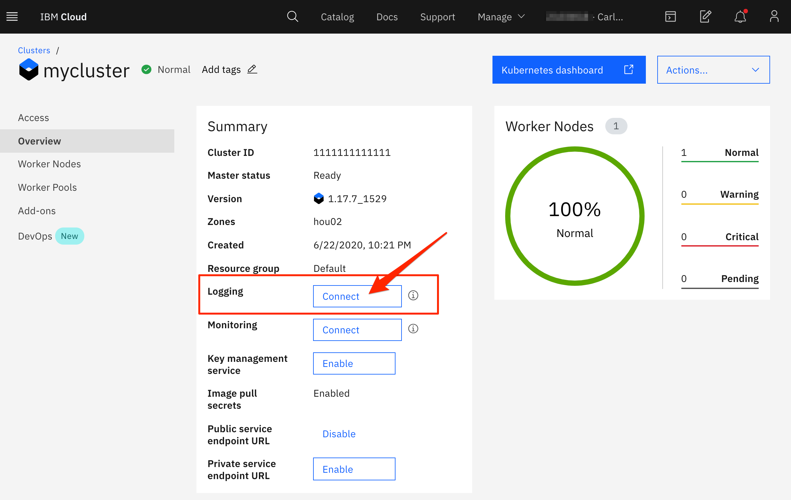

### Prerequisite
- Create an IBM Kubernetes Cluster, it can be a Cluster using the Free plan

### Connecting a LogDNA agent to a standard Kubernetes cluster

1. Open you Kubernetes Cluster Overview, in the Summary find _Loggin__ row and click **Connect**
    
1. Click **Create and connect**
    
1. Select a LogDNA plan such as **Free** and click **Create**
1. Verify Cluster is connected to logDNA service instance by clicking the button **Launch** next to __Logging__
    

- For more information on configuring the logDNA Agent on your Cluster:
    -  [Connecting a LogDNA agent to a standard Kubernetes cluster](https://cloud.ibm.com/docs/Log-Analysis-with-LogDNA?topic=Log-Analysis-with-LogDNA-config_agent_kube_cluster) or
    - [Connecting a LogDNA agent to an OpenShift Kubernetes cluster](https://cloud.ibm.com/docs/Log-Analysis-with-LogDNA?topic=Log-Analysis-with-LogDNA-config_agent_os_cluster)
