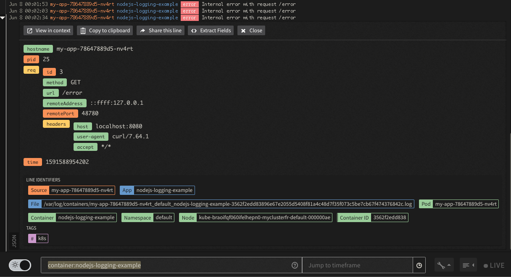

### Prerequisite
- Configure the LogDNA Agent on a kubernetes cluster, you can use one of the labs in this bootcamp located [here](/monitoring/logdna/#activities)


## Logging library in Node.js

- There are multiple logging libraries available for Node.js, on this example we are going to use [pino](https://www.npmjs.com/package/pino)

- You can instrument a Node.js express web server using `pino-http` the example is located in GitHub [app.js](https://github.com/ibm-cloud-architecture/learning-cloudnative-101/blob/master/examples/logging/nodejs/app.js)
```javascript
const express = require('express')
const isProduction = process.env.NODE_ENV === 'production'
const formatters = {
    level(label, number) {
        return { level: label }
    }
}
const pino = require('pino-http')({
    prettyPrint: isProduction ? false : true,
    level: isProduction ? 'error' : 'info',
    formatters: formatters,
    messageKey: 'message'
})
const PORT = process.env.PORT || 8080;

var app = express()

app.use(pino)

app.get('/', function (req, res) {
    req.log.info('this is a info log message')
    res.send('Hello World')
})
app.get('/error', function (req, res, next) {
    req.log.error('Internal error with request /error')
    res.status(503).send('Internal error')
})

app.listen(PORT, () => {
    console.log(`Listening on PORT=${PORT} and isProduction=${isProduction}`);
})
```

## Deploy the sameple application

- Create a namespace
    ```bash
    kubectl create deployment my-app --image=ibmcase/nodejs-logging-example
    ```


## Test the application
- Expose application web service on local port 8080
    ```shell
    kubectl port-forward deployment/my-app 8080:8080
    ```

- Send http request to the web service
    ```shell
    while true; do sleep 1; curl http://localhost:8080 -s -w "\n"; done
    ```
    Output looks like this
    ```
    Internal error
    ```

- Get the logs
    ```bash
    kubectl logs deployment/my-app -f
    ```

- The error line printend is JSON
    ```json
    {"level":"error","time":1591588923197,"pid":25,"hostname":"my-app-78647889d5-nv4rt","req":{"id":2,"method":"GET","url":"/error","headers":{"host":"localhost:8080","user-agent":"curl/7.64.1","accept":"*/*"},"remoteAddress":"::ffff:127.0.0.1","remotePort":48458},"message":"Internal error with request /error"}
    ```

## Find the JSON logs in LogDNA

- Open the Views
- Search for `container:nodejs-logging-example`


