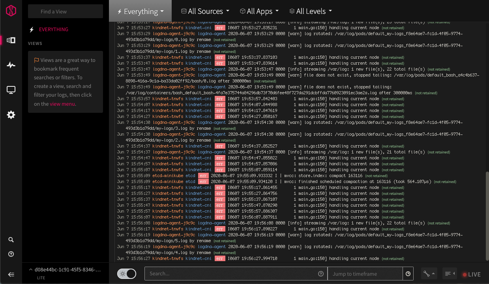

<Accordion>
  <AccordionItem title="1. Provisioning a LogDNA instance from the catalog">
To provision an instance of LogDNA from the IBM Catalog catalog, complete the following steps:

1. [Log in to the IBM Cloud console](https://cloud.ibm.com/login)

1. Click **Catalog**. The list of the services that are available on IBM Catalog opens.

1. To filter the list of services that is displayed, select the **Developer Tools** category.

1. Click the **IBM Cloud Log Analysis with LogDNA** tile.

1. Select the region. 

1. Select a service plan. By default, the **Lite** plan is set.

    For more information about the service plans, see [Service plans](https://cloud.ibm.com/docs/Monitoring-with-Sysdig?topic=Monitoring-with-Sysdig-pricing_plans#pricing_plans).

1. Enter a service name.

1. Select a resource group. By default, the **Default** resource group is set.

1. Click **Create**.

After you provision an instance, 

* The *Observability* dashboard opens. 
* A service ID is automatically created. You can use this service ID to get the LogDNA access key for your instance. 

Next, configure a metric source by adding a LogDNA agent. This agent is responsible for collecting and forwarding logs to LogDNA. 
  </AccordionItem>
</Accordion>

<Accordion>
  <AccordionItem title="2. Create minikube cluster">

1. Create the VM and ssh into it
    ```bash
    vagrant up
    vagrant ssh
    ```
1. Run minikube start with the following command
    ```bash
    minikube start --driver=none
    ```


  </AccordionItem>
</Accordion>


<Accordion>
  <AccordionItem title="3. Install LogDNA agent">

1. Setup the configuration variable for LogDNA Agent, replace the variables with valid values, you can get this from your LogDNA instance on IBM Cloud console:
    ```bash
    LOGDNA_ACCESS_KEY="INSERT KEY HERE"
    REGION="us-south | us-east | eu-de | eu-gb | jp-tok | au-syd"
    ```
    - **LOGDNA_ACCESS_KEY** is the ingestion key for the instance that you previously created.
    - **REGION** It the region where your logdna instance is located.
1. Create a namespace `ibm-observe`
    ```bash
    kubectl create namespace ibm-observe 
    ```
1. Create a kubernetes secret in the namesapce `ibm-observe` where the logdna agent will be install.
    ```bash
    (set -u; \
    kubectl create secret generic logdna-agent-key \
      --from-literal=logdna-agent-key=${LOGDNA_ACCESS_KEY} \
      -n ibm-observe \
    )
    ```
1. Run the following command to download the install script and execute
    ```bash
    (set -u; \
    kubectl create \
      -f https://assets.${REGION}.logging.cloud.ibm.com/clients/logdna-agent-ds.yaml \
      -n ibm-observe \
    )
    ```
1. Verify logdna agent is working
    ```bash
    kubectl get -n ibm-observe ds/logdna-agent
    kubectl logs -n ibm-observe ds/logdna-agent
    ```


  </AccordionItem>
</Accordion>

<Accordion>
  <AccordionItem title="4. Verify insgestion of logs">

- Open LogDNA
- Select Views
- Kubernetes messages should show up
- To test simple log messages create a Pod with bash prompt
    ```
    kubectl run my-logs --rm -it --image=busybox -- bash
    ```
- Send a message to stdout
    ```bash
    echo "this is log message on stdout"
    ```
- Send a message to stderr
    ```bash
    echo "this is a log message on stderr" >&2
    ```
- [Navigating the Dashboard](https://docs.logdna.com/docs/how-to-use-the-dashboard)




  </AccordionItem>
</Accordion>

<Accordion>
  <AccordionItem title="5. Remove the LogDNA agent">

- Delete the namespace where the logdna agent is installed
    ```bash
    kubectl delete ns ibm-observe
    ```


  </AccordionItem>
</Accordion>
