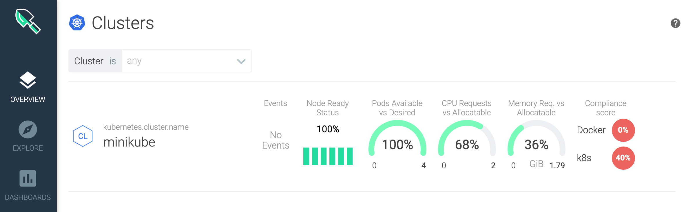
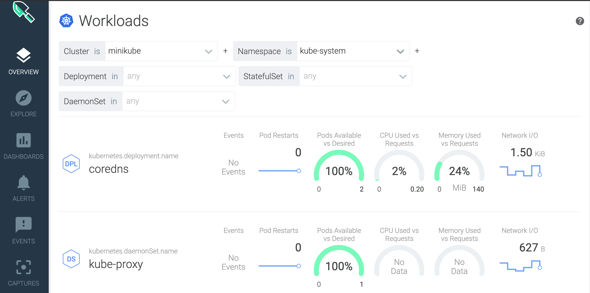

<Accordion>
  <AccordionItem title="Provisioning a Sysdig instance from the catalog">
To provision an instance of Sysdig from the IBM Catalog catalog, complete the following steps:

1. [Log in to the IBM Cloud console](https://cloud.ibm.com/login)

2. Click **Catalog**. The list of the services that are available on IBM Catalog opens.

3. To filter the list of services that is displayed, select the **Developer Tools** category.

4. Click the **IBM Cloud Monitoring with Sysdig}** tile. The *Observability* dashboard opens.

5. Select **Create instance**. 

6. Select the region. 

7. Select a service plan. By default, the **Trial** plan is set.

    For more information about the service plans, see [Service plans](https://cloud.ibm.com/docs/Monitoring-with-Sysdig?topic=Monitoring-with-Sysdig-pricing_plans#pricing_plans).

8. Enter a service name.

9. Select a resource group. By default, the **Default** resource group is set.

10. Set on automatic collection of platform metrics by clicking **Enable**.

11. Click **Create**.

After you provision an instance, 

* The *Observability* dashboard opens. 
* A service ID is automatically created. You can use this service ID to get the Sysdig access key for your instance. The name of the service ID has the following format: `{InstanceName}-key-admin`.

Next, configure a metric source by adding a Sysdig agent. This agent is responsible for collecting and forwarding metrics to Sysdig. 
  </AccordionItem>
</Accordion>

<Accordion>
  <AccordionItem title="Create minikube cluster">

- For this section use the [Cloud Native VM](/prerequisites/#cloud-native-vm) to run minikube
- Create the VM and ssh into it
    ```bash
    vagrant up
    vagrant ssh
    ```
- Login as root
    ```bash
    sudo su
    ```
- Ignore the login message about minikube, we need to create the minikube as root with no driver
    ```bash
    minikube start --driver=none
    source /home/vagrant/.bashrc
    ```
- Setup the configuration variable for Sysdig Agent, replace the variables with valid values, you can get this from your Sysdig instance on IBM Cloud console:
    ```bash
    SYSDIG_ACCESS_KEY="INSERT KEY HERE"
    REGION="us-south | us-east | eu-de | eu-gb | jp-tok | au-syd"
    TAG_DATA="cloudnative:bootcamp"
    ```
    - **SYSDIG_ACCESS_KEY** is the ingestion key for the instance that you previously retrieved.
    - **COLLECTOR_ENDPOINT** is the ingestion URL for the region where the monitoring instance is available that you previously retrieved.
    - **TAG_DATA** are comma-separated tags that are formatted as TAG_NAME:TAG_VALUE. You can associate one or more tags to your Sysdig agent. For example: role:serviceX,location:us-south. Later on, you can use these tags to identify metrics from the environment where the agent is running.

- Login as root if not already
    ```bash
    sudo su
    ```
- Run the following command to download the install script and execute
    ```bash
    SYSDIG_ACCESS_KEY="de7fc7fb-c80e-45ba-ae99-e99408ae172a"
    TAG_DATA="bootcamp:cloud"
    REGION=us-east
    curl -sL https://ibm.biz/install-sysdig-k8s-agent | \
    bash -s -- \
    -a ${SYSDIG_ACCESS_KEY} \
    -c ingest.${REGION}.monitoring.cloud.ibm.com \
    -ac 'sysdig_capture_enabled: false' \
    -t ${TAG_DATA} \
    -aws
    ```

</AccordionItem>
</Accordion>

<Accordion>
  <AccordionItem title="Install Sysdig agent">

- Login as root if not already
    ```bash
    sudo su
    ```
- Run the following command to download the install script and execute
    ```bash
    SYSDIG_ACCESS_KEY="de7fc7fb-c80e-45ba-ae99-e99408ae172a"
    TAG_DATA="bootcamp:cloud"
    REGION=us-east
    curl -sL https://ibm.biz/install-sysdig-k8s-agent | \
    bash -s -- \
    -a ${SYSDIG_ACCESS_KEY} \
    -c ingest.${REGION}.monitoring.cloud.ibm.com \
    -ac 'sysdig_capture_enabled: false' \
    -t ${TAG_DATA} \
    -aws
    ```

</AccordionItem>
</Accordion>

<Accordion>
  <AccordionItem title="Access the Dashboards">

- Open Sysdig 
- Select Overview
- Explore the Kubernetes Dashboards, select Explore->Kubernetes

- [Cluster](https://docs.sysdig.com/en/clusters-data.html)



- [Nodes](https://docs.sysdig.com/en/nodes-data.html)


- [Namespaces](https://docs.sysdig.com/en/namespaces-data.html)


- [Workloads](https://docs.sysdig.com/en/workloads-data.html)




  </AccordionItem>
</Accordion>
