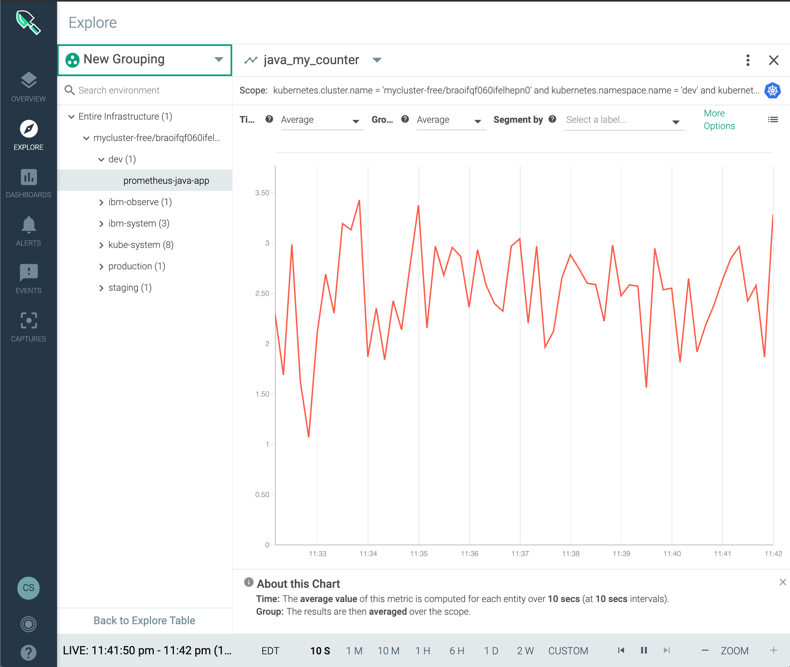

### Prerequisite

- Configure the Sysdig Agent on a kubernetes cluster, you can use one of the labs in this bootcamp located [here](/monitoring/sysdig/#activities)


### Deploy java application enable with prometheus

- Review the instrumented java application [Main.java](/custom-metrics-examples/prometheus/java/src/main/java/Main.java)

- Creagte a namespace to deploy the application
```shell
kubectl create ns dev
```
- Deploy the following java application
```shell
cat <<EOF | kubectl -n dev apply -f -
apiVersion: apps/v1
kind: Deployment
metadata:
  name: prometheus-java-app
spec:
  selector:
    matchLabels:
      app: prometheus-java-app
  template:
    metadata:
      labels:
        app: prometheus-java-app
      annotations:
        prometheus.io/scrape: "true"
        prometheus.io/path: "/prometheus"
        prometheus.io/port: "8080"
    spec:
      containers:
        - name: prometheus-java-app
          image: docker.io/ibmcase/prometheus-java
EOF
```
- Expose java application service
```shell
kubectl -n dev create svc nodeport prometheus-java-app --tcp=80:80 --tcp 8080:8080
```

- Deploy the following nodej.js application


### Test the application
- Expose application web service on local port 8000, and prometheus on 9080, each command on a new terminal
```shell
kubectl -n dev port-forward service/prometheus-java-app 8000:80
```
```shell
kubectl -n dev port-forward service/prometheus-java-app 9080:8080
```

- Send http request to the web service
```shell
curl -si http://localhost:8000
```
Output looks like this
```
HTTP/1.1 200 OK
Date: Wed, 03 Jun 2020 03:14:52 GMT
Transfer-encoding: chunked
```

- Query prometheus endpoint
```shell
curl http://localhost:8000/prometheus
```
Output looks like this
```
# HELP process_cpu_seconds_total Total user and system CPU time spent in seconds.
# TYPE process_cpu_seconds_total counter
process_cpu_seconds_total 1.39
# HELP process_start_time_seconds Start time of the process since unix epoch in seconds.
```

## Java Prometheus Metrics in Sysdig
- Open Sysdig
- Select Explore
- Select Deployments
- Select `dev` namespace
- Select deployment `prometheus-java-app`
- Select metrics collected start with `jvm_` or `java_` for example `java_my_counter`



# References

- Sysdig Blog Prometheus metrics / OpenMetrics code instrumentation (https://sysdig.com/blog/prometheus-metrics/)
