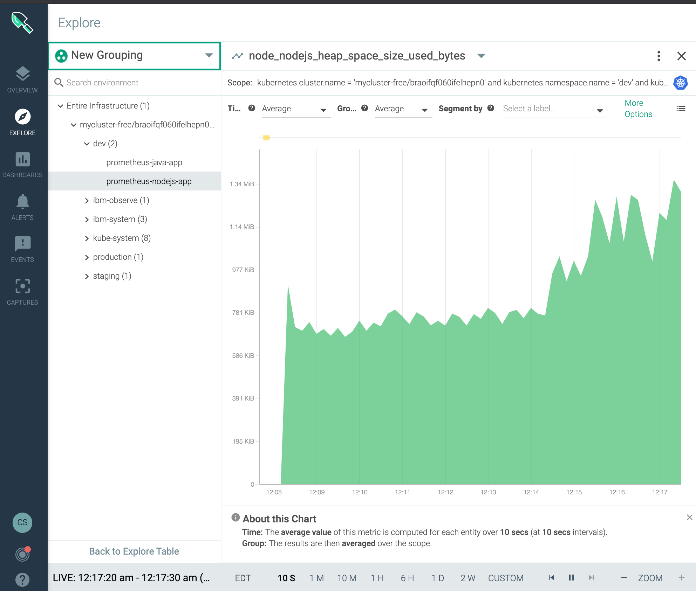

### Prerequisite

- Configure the Sysdig Agent on a kubernetes cluster, you can use one of the labs in this bootcamp located [here](/monitoring/sysdig/#activities)


### Deploy nodejs application enable with prometheus

- Review the instrumented nodejs application [app.js](/custom-metrics-examples/prometheus/javascript/app.js)

- Creagte a namespace to deploy the application
```shell
kubectl create ns dev
```
- Deploy the following nodejs application
```shell
cat <<EOF | kubectl -n dev apply -f -
apiVersion: apps/v1
kind: Deployment
metadata:
  name: prometheus-nodejs-app
spec:
  selector:
    matchLabels:
      app: prometheus-nodejs-app
  template:
    metadata:
      labels:
        app: prometheus-nodejs-app
      annotations:
        prometheus.io/scrape: "true"
        prometheus.io/path: "/metrics"
        prometheus.io/port: "8080"
    spec:
      containers:
        - name: prometheus-nodejs-app
          image: docker.io/ibmcase/prometheus-nodejs
EOF
```
- Expose nodejs application service
```shell
kubectl -n dev create svc nodeport prometheus-nodejs-app --tcp 8080:8080
```

- Deploy the following nodej.js application


### Test the application
- Expose application web service on local port 9080
```shell
kubectl -n dev port-forward service/prometheus-nodejs-app 9080:8080
```

- Send http request to the web service
```shell
while true; do sleep 1; curl http://localhost:9080 -si | head -1 ; done
```
Output looks like this
```
HTTP/1.1 200 OK
```

- Query prometheus endpoint
```shell
curl http://localhost:9080/metrics
```
Output looks like this
```
# HELP node_process_cpu_user_seconds_total Total user CPU time spent in seconds.
# TYPE node_process_cpu_user_seconds_total counter
node_process_cpu_user_seconds_total 0.2760000000000001 1591157428088
```

## nodejs Prometheus Metrics in Sysdig
- Open Sysdig
- Select Explore
- Select Deployments
- Select `dev` namespace
- Select deployment `prometheus-nodejs-app`
- Select metrics collected start with `jvm_` or `nodejs_` for example `node_nodejs_heap_space_size_used_bytes`



## References

- Sysdig Blog Prometheus metrics / OpenMetrics code instrumentation (https://sysdig.com/blog/prometheus-metrics/)
