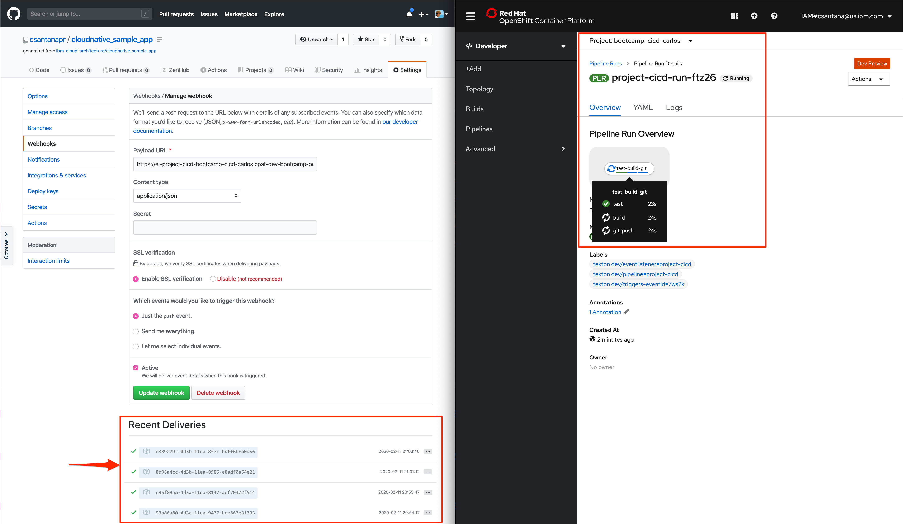
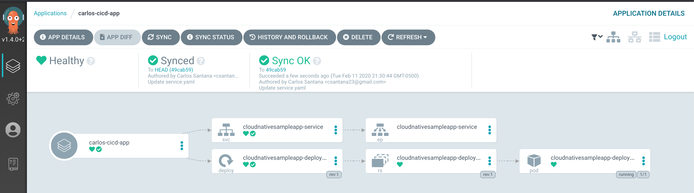

<AnchorLinks>
  <AnchorLink>OpenShift Setup</AnchorLink>
  <AnchorLink>Configure Github Personal Access Token</AnchorLink>
  <AnchorLink>ArgoCD Configuration</AnchorLink>
  <AnchorLink>Tekton Pipeline Configuration</AnchorLink>
  <AnchorLink>Tekton Trigger Configuration</AnchorLink>
</AnchorLinks>


## OpenShift Setup

- Create a new project `bootcamp-cicd-${userid}` all lowercase, and no spaces
    ```bash
    oc new-project bootcamp-cicd-${userid}
    ```
- Set the environment variable `NAMESPACE` to be use during Solution
    ```bash
    export NAMESPACE=$(oc project -q)
    echo "NAMESPACE set to $NAMESPACE"
    ```

## Configure Github Personal Access Token

- For your CI pipeline to connect to and use your GitHub repo, it will need a [GitHub personal access token](https://help.github.com/en/github/authenticating-to-github/creating-a-personal-access-token-for-the-command-line) with `public_repo` and `write:repo_hook` scopes. 
- Navigate to [Developer Settings](https://github.com/settings/tokens) and generate a new token; name it something like "CI pipeline"
- Select `public_repo` scope to enable git clone
- Select `write:repo_hook` scope so the pipeline can create a web hook

- The GitHub UI will never again let you see this token, so be sure to **save the token** in your password manager or somewhere safe that you can access later on
- Create the secret for the Infra repository, replace `<GIT_USERNAME>` and `<GIT_TOKEN>`, keep the quotes
    ```bash
    export GIT_USERNAME='<GIT_USERNAME>'
    export GIT_TOKEN='<GIT_TOKEN>'
    ```
    ```bash
    oc create secret generic git-infra-secret --from-literal=username="$GIT_USERNAME" --from-literal=token="$GIT_TOKEN"
    ```

## ArgoCD Configuration

- Create a new Infra repository using the following git repo as template https://github.com/ibm-cloud-architecture/cloudnative_sample_app_deploy
- The new location of the Infra repository would look like `https://github.com/${GIT_USER}/cloudnative_sample_app_deploy`
- Access the ArgoCD UI, to get the server url run the following command
    ```bash
    export ARGOCD_URL=$(oc get route argocd-server -n argocd -o jsonpath='{.spec.host}')
    echo "ARGOCD URL: https://$ARGOCD_URL"
    ```
- Login into ArgoCD UI using `admin` as username and for the password get the name of the pod for the argocd server running the following command
    ```bash
    oc get pods -n argocd -l app.kubernetes.io/name=argocd-server -o name | cut -d'/' -f 2
    ```
- Create a new ArgoCD application using the UI or CLI
  - SYNC POLICY: `Automatic`
  - Application Name: `${userid}-app`
  - REPO URL: `https://github.com/${GIT_USER}/cloudnative_sample_app_deploy`
  - Revision: `master`
  - Path: `yamls`
  - Cluster: `https://kubernetes.default.svc` to deploy in-cluster
  - Namespace: `bootcamp-cicd-${userid}`
- Expose application by creating a `route.yaml`
    ```bash
    cat <<'EOF' >route.yaml
    apiVersion: route.openshift.io/v1
    kind: Route
    metadata:
      name: cloudnativesampleapp-route
    spec:
      port:
        targetPort: http
      to:
        kind: Service
        name: cloudnativesampleapp-service
    EOF
    ```
- Apply the `route.yaml`
    ```bash
    oc apply -f route.yaml -n $NAMESPACE
    ```
- Test the Application usin the new route
    ```bash
    export APP_URL=$(oc get route cloudnativesampleapp-route -o jsonpath='{.spec.host}' -n $NAMESPACE)
    curl http://$APP_URL/greeting?name=Carlos
    ```

## Tekton Pipeline Configuration

- Create a new Code repository using the following git repo as template https://github.com/ibm-cloud-architecture/cloudnative_sample_app
- The new location of the Code repository would look like `https://github.com/${GIT_USER}/cloudnative_sample_app`
- Create a git resource yaml **git.yaml**, replace `<GIT_USERNAME>` with the git username or organization
    ```bash
    export GIT_USERNAME='<GIT_USERNAME>'
    ```
    ```bash
    cat <<EOF >git.yaml
    apiVersion: tekton.dev/v1alpha1
    kind: PipelineResource
    metadata:
      name: source
    spec:
      type: git
      params:
        - name: revision
          value: master
        - name: url
          value: https://github.com/$GIT_USERNAME/cloudnative_sample_app
    EOF
    ```
    - Apply the `git.yaml`
    ```bash
    oc apply -f git.yaml -n $NAMESPACE
    ```
- Create an image resource yaml **image.yaml**, the image url needs to specify the target namespace in `$NAMESPACE` for the `default` ServiceAccount in the namespace to be able to pull the image from the internal registry
    ```bash
    cat <<EOF >image.yaml
    apiVersion: tekton.dev/v1alpha1
    kind: PipelineResource
    metadata:
      name: image
    spec:
      type: image
      params:
        - name: url
          value: image-registry.openshift-image-registry.svc:5000/$NAMESPACE/cloudnative_sample_app
    EOF
    ```
    - Apply the `image.yaml`
    ```bash
    oc apply -f image.yaml -n $NAMESPACE
    ```
- Verify the resources
    ```bash
    tkn resource ls  -n $NAMESPACE
    ```
    ```
    NAME     TYPE    DETAILS
    source   git     url: https://github.com/csantanapr/cloudnative_sample_app
    image    image   url: image-registry.openshift-image-registry.svc:5000/bootcamp-cicd-carlos/cloudnative_sample_app
    ```
- Download the task file [task-build-git.yaml](/yamls/project-cicd/solution/task-build-git.yaml) to build the image, push the image to the registy, and update the Infra git repository
- Apply manifest
    ```bash
    oc apply -f task-build-git.yaml -n $NAMESPACE
    ```
- Verify tasks
    ```bash
    tkn task ls -n $NAMESPACE
    ```
    ```
    NAME        AGE
    build-git   8 minutes ago
    ```
- Test the task using your own Infra git repository, replace the parameters values `<GIT_EMAIL>`, `<GIT_NAME>`, and `<GIT_REPOSITORY>` with your Infra git repository.
- Excluding the protocol scheme `https://` for example `github.com/csantanapr/cloudnative_sample_app_deploy.git`
    ```bash
    export GIT_EMAIL='<GIT_EMAIL>'
    export GIT_NAME='<GIT_NAME>'
    export GIT_REPOSITORY='<GIT_REPOSITORY>'
    ```
    ```bash
    tkn task start build-git \
            --showlog \
            -i source=source \
            -i image=image \
            -p GIT_EMAIL=$GIT_EMAIL \
            -p GIT_NAME=$GIT_NAME \
            -p GIT_REPOSITORY=$GIT_REPOSITORY \
            -s pipeline \
            -n $NAMESPACE
    ```
- Verify last task run 
    ```bash
    tkn taskrun ls --limit 1 -n $NAMESPACE
    ```
    ```
    NAME                  STARTED         DURATION    STATUS               
    build-git-run-d2j88   7 minutes ago   2 minutes   Succeeded
    ```
- Create a Pipeline **pipeline.yaml** with the task, replace the parameters values `<GIT_EMAIL>`, `<GIT_NAME>`, and `<GIT_REPOSITORY>`  with your Infra git repository.
- Excluding the protocol scheme `https://` for example `github.com/csantanapr/cloudnative_sample_app_deploy.git`
    ```bash
    export GIT_EMAIL='<GIT_EMAIL>'
    export GIT_NAME='<GIT_NAME>'
    export GIT_REPOSITORY='<GIT_REPOSITORY>'
    ```
    ```bash
    cat <<EOF >pipeline.yaml
    apiVersion: tekton.dev/v1alpha1
    kind: Pipeline
    metadata:
      name: project-cicd
    spec:
      resources:
        - name: source
          type: git
        - name: image
          type: image
      tasks:
        - name: task
          taskRef:
            name: build-git
          resources:
            inputs:
              - name: source
                resource: source
              - name: image
                resource: image
          params:
            - name: GIT_REPOSITORY
              value: $GIT_REPOSITORY
            - name: GIT_EMAIL
              value: $GIT_EMAIL
            - name: GIT_NAME
              value: $GIT_NAME
    EOF
    ```
- Apply manifest
    ```bash
    oc apply -f pipeline.yaml -n $NAMESPACE
    ```
- Verify pipeline
    ```bash
    tkn pipeline ls -n $NAMESPACE
    ```
    ```
    NAME           AGE              LAST RUN   STARTED   DURATION   STATUS
    project-cicd   22 seconds ago   ---        ---       ---        ---
    ```
- Run the Pipeline using the sevice account `pipeline`
    ```bash
    tkn pipeline start project-cicd \
            --showlog \
            -r source=source \
            -r image=image \
            -s pipeline \
            -n $NAMESPACE
    ```
- Verify las Pipeline Run
    ```bash
    tkn pipelinerun ls --limit 1 -n $NAMESPACE
    ```
    ```
    NAME                     STARTED         DURATION    STATUS               
    project-cicd-run-wvf82   4 minutes ago   2 minutes   Succeeded
    ```

## Tekton Trigger Configuration

- Create the Trigger Template file **trigger-template.yaml**
    ```bash
    cat <<'EOF' >trigger-template.yaml
    apiVersion: tekton.dev/v1alpha1
    kind: TriggerTemplate
    metadata:
      name: project-cicd
    spec:
      params:
        - name: gitrevision
          description: The git revision
          default: master
        - name: gitrepositoryurl
          description: The git repository url
      resourcetemplates:
        - apiVersion: tekton.dev/v1alpha1
          kind: PipelineRun
          metadata:
            generateName: project-cicd-run-
          spec:
            pipelineRef:
              name: project-cicd
            resources:
              - name: image
                resourceRef:
                  name: image
              - name: source
                resourceSpec:
                  type: git
                  params:
                    - name: revision
                      value: $(params.gitrevision)
                    - name: url
                      value: $(params.gitrepositoryurl)
    EOF
    ```
- Apply manifest
    ```bash
    oc apply -f trigger-template.yaml -n $NAMESPACE
    ```
- Create the Trigger Template file **trigger-binding.yaml**
    ```bash
    cat <<'EOF' >trigger-binding.yaml
    apiVersion: tekton.dev/v1alpha1
    kind: TriggerBinding
    metadata:
      name: project-cicd
    spec:
      params:
        - name: gitrevision
          value: $(body.head_commit.id)
        - name: gitrepositoryurl
          value: $(body.repository.url)
        - name: contenttype
          value: $(header.Content-Type)
    EOF
    ```
- Apply manifest
    ```bash
    oc apply -f trigger-binding.yaml -n $NAMESPACE
    ```
- Create the Trigger Template file **trigger-listerner.yaml**
    ```bash
    cat <<'EOF' >trigger-listerner.yaml
    apiVersion: tekton.dev/v1alpha1
    kind: EventListener
    metadata:
      name: project-cicd
    spec:
      serviceAccountName: pipeline
      triggers:
        - name: project-cicd-trig
          binding:
            name: project-cicd
          template:
            name: project-cicd
    EOF
    ```
- Apply manifest
    ```bash
    oc apply -f trigger-listerner.yaml -n $NAMESPACE
    ```
- To test in a new terminal start a port forward session
    ```bash
    kubectl port-forward $(oc get pod -o=name -l eventlistener=project-cicd) 8080 -n $NAMESPACE
    ```
- Now send a HTTP Request simulating a Github webhook event, replace the `url` value below.
    ```bash
    curl -X POST \
      https://el-project-cicd-bootcamp-cicd-carlos.cpat-dev-bootcamp-ocp43-afb9c6047b062b44e3f1b3ecfeba4309-0000.us-south.containers.appdomain.cloud \
      -H 'Content-Type: application/json' \
      -H 'X-Hub-Signature: sha1=2da37dcb9404ff17b714ee7a505c384758ddeb7b' \
      -d '{
            "head_commit":
            {
                    "id": "master"
            },
            "repository":
            {
                    "url": "https://github.com/csantanapr/cloudnative_sample_app.git"
            }
    }'
    ```
- Verify Pipeline run is running
    ```bash
    tkn pipelinerun ls --limit 1 -n $NAMESPACE  
    ```
    ```                                                        
    NAME                     STARTED         DURATION   STATUS             
    project-cicd-run-xcjt8   5 seconds ago   ---        Running
    ```
    Get the logs
    ```bash
    tkn pipelinerun logs -f -a -n $NAMESPACE project-cicd-run-xcjt8
    ```
- Expose Event Listener service via secure route
    ```bash
    oc create route edge --service=el-project-cicd
    ```
- Get the URL to configure in Git repository Web Hook 
    ```bash
    export GIT_WEBHOOL_URL=$(oc get route el-project-cicd -o jsonpath='{.spec.host}' -n $NAMESPACE)
    echo "https://$GIT_WEBHOOL_URL"
    ```
- Create the Git Web Hook Manually to send `push` events or create programatically below, replace `<GIT_REPO_NAME>` for Code repo name
    ```bash
    export GIT_USERNAME='<GIT_USERNAME>'
    export GIT_TOKEN='<GIT_TOKEN>'
    export GIT_REPO_NAME='<GIT_REPO_NAME>'
    ```
- Run `curl` to create the web hook
```bash
curl -v -X POST -u $GIT_USERNAME:$GIT_TOKEN \
-d "{\"name\": \"web\",\"active\": true,\"events\": [\"push\"],\"config\": {\"url\": \"https://$GIT_WEBHOOL_URL\",\"content_type\": \"json\",\"insecure_ssl\": \"0\"}}"  -L https://api.github.com/repos/$GIT_USERNAME/$GIT_REPO_NAME/hooks
```
**NOTE** Do not share the url, as it's not configure with secret, for production configure the listener and the git web hook with a secret
- Make a change on the Code repository, and verify that Github sent the WebHook to the event listener, and that the Pipeline runs in OpenShift Console

- After the Pipeline run is done, wait a few minutes the application should be updated by ArgoCD

