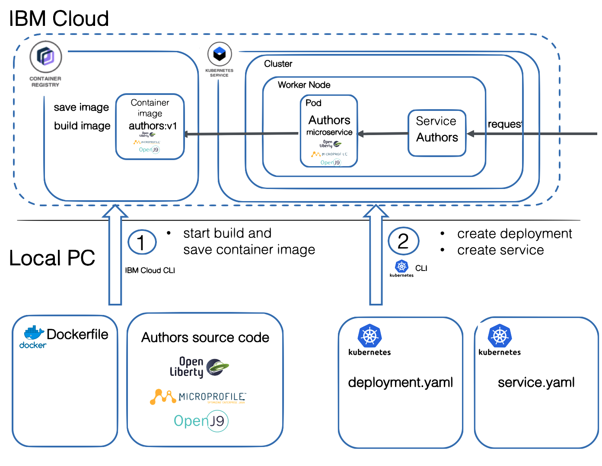

## Cloud Native Starter
[Cloud Native Starter](https://cloud-native-starter.mybluemix.net) is an open source project that demonstrates how to develop complete enterprise applications with Java and MicroProfile and how to operate them with Kubernetes and Istio.

## 1. Build a Java Microservice and deploy the Microservice to Kubernetes on IBM Cloud
- This [workshop](https://github.com/IBM/cloud-native-starter/tree/master/workshop-one-service) demonstrates how to develop the 'authors' microservice with MicroProfile and how to deploy it to Kubernetes.
  

## 2. Let’s get started with cloud native Java applications on Kubernetes

[comment]: <> (TODO: replace git url when PR is merged upstream https://github.com/IBM/cloud-native-starter/pull/41)
- In this [workshop](https://github.com/csantanapr/cloud-native-starter/blob/issue-40-fix-istio/workshop/README.md) you will learn how to develop microservices with MicroProfile, how to implement REST APIs, how to do traffic management and how to develop resilient applications. The application, which uses several microservices, is deployed to Kubernetes.
  

